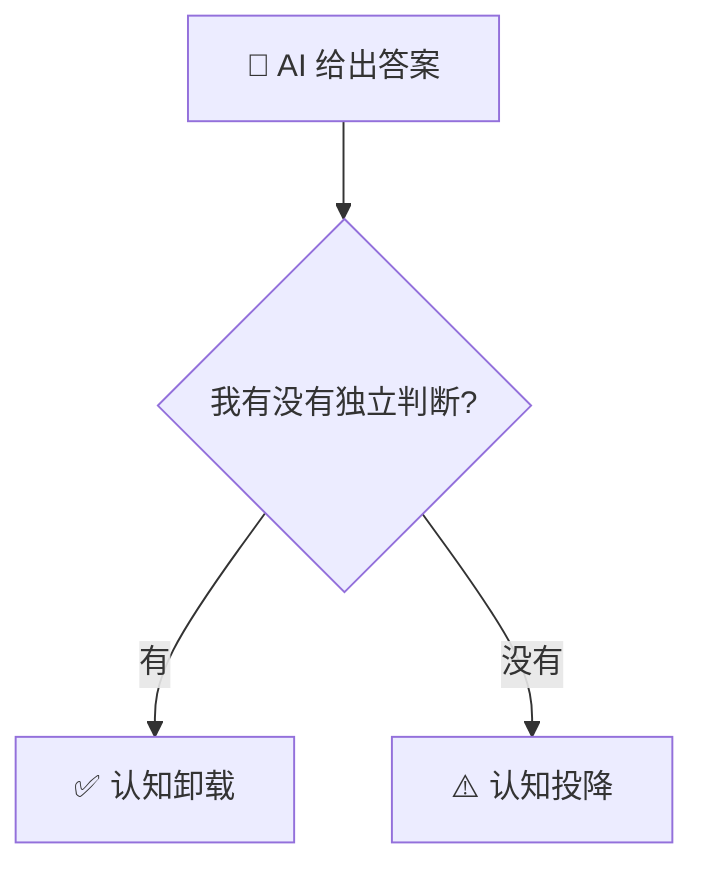

# AGENT.md

面向 AI 编码代理（以及人类协作者）的项目说明。修改本仓库前请先读完本文件。

## 项目概览

蘇里（严广杰 / sulifreely）的个人网站，部署在 Vercel，域名 `yanguangjie.com`。

- 框架：Astro 5（静态站点，`output: static`）
- 内容：Markdown 内容集合（博客 + 演讲）
- 字体：正文西文用 Mulish（自托管 `@fontsource/mulish`，权重 400/600/700/800）→ 中文霞鹜文楷 Lite（`lxgw-wenkai-lite-webfont`，自托管、按 unicode-range 分片）→ `PingFang SC` / `Microsoft YaHei` 系统兜底；代码块用 JetBrains Mono（`@fontsource/jetbrains-mono`）。完整字族栈见 `src/styles/global.css` 的 `--font-sans` / `--font-mono`；正文关闭连字，代码块保留
- 幻灯片渲染：`marked`
- 图表：`mermaid`，仅在文章含图表时由客户端按需懒加载，并跟随明暗主题重渲染
- 风格：极简、内容优先，支持明暗主题；正文文字偏柔和（`--fg-body`），标题更深更重（`--fg`）以拉开层级

## 常用命令

```bash
npm install      # 安装依赖（使用公共 npm registry，见 .npmrc）
npm run dev      # 本地开发，http://localhost:4321
npm run check    # 类型检查（astro check，等价于「tslint」门禁）
npm run build    # 先 astro check 再构建到 dist/（类型不通过则构建失败）
npm run preview  # 预览构建产物
```

修改后请跑通 `npm run build`，确保无报错。

## 目录结构

```
skills/
  personal/          y-fable, y-writer, y-thought, y-share
scripts/
  install-skills.sh  安装 skills 到 agent 技能目录
src/
  content/
    blog/            博客文章（Markdown）
    talks/           演讲（Markdown，正文即幻灯片源）
    config.ts        内容集合的 zod schema
  layouts/
    BaseLayout.astro 站点骨架（head/SEO/主题/页头页脚）
    PostLayout.astro 博客文章排版
  components/         Header / Footer / PostCard / ThemeToggle
  pages/
    index.astro              首页（博客列表）
    blog/[...slug].astro     博客详情
    talks/index.astro        演讲列表
    talks/[slug].astro       演讲详情
    talks/[slug]/slides.astro 全屏幻灯片引擎
    about.astro              关于
    rss.xml.js               RSS
    404.astro
  styles/global.css  全局样式与明暗主题 CSS 变量
public/
  favicon.png        头像 + favicon
  images/
    blogs/           博客用图（按需新建）
    talks/           演讲用图
astro.config.mjs     site 域名与集成（mdx / sitemap / Shiki 代码高亮 / remarkMermaid 图表）
```

## Skills 安装

`skills/` 下含 `SKILL.md` 的目录会被 `scripts/install-skills.sh` 发现，并按目录名软链到 agent 技能目录（默认 `~/.cursor/skills` 与 `~/.claude/skills`）。

```bash
npm run install-skills              # 软链安装（跳过已存在）
npm run install-skills:force        # 覆盖同名链接（移动过 skill 目录后用它重指）
scripts/install-skills.sh --list    # 列出发现的 skill
scripts/install-skills.sh --dry-run # 预演，不改动
scripts/install-skills.sh --uninstall  # 移除指回本仓的链接
```

安装或改动 skill 后需**重载 Cursor / 重启 agent** 才生效。

## 内容写作约定

### 博客

在 `src/content/blog/` 新建 `.md`，文件名即 URL slug。frontmatter：

```md
---
title: 标题
date: 2026-06-28
description: 一句话摘要（用于列表与 RSS）
tags: [标签一, 标签二]
cover: /images/blogs/xxx.jpg   # 可选封面图
draft: false                    # true 则不在列表/详情/RSS 中出现
---
```

- 列表（首页博客、Talks）按 `date` **倒序**（越新越靠前）。同一天有多篇时，用带时间的 ISO 形式区分先后，例如 `date: 2026-06-27T16:00:00+08:00`；页面只展示到「年-月-日」，时间仅用于排序。
- 正文是标准 Markdown，代码块自动高亮并跟随主题。
- `tags` **最多 3 个**，选最贴切的即可，不要为了覆盖搜索词而堆砌标签。已在 `src/content/config.ts` 的 zod schema 中用 `.max(3)` 硬校验，超过会导致 `npm run check` / `npm run build` 报错。

### 趣味性：emoji 与图表

为了让文章读起来更轻松、信息结构更直观，鼓励（但不滥用）以下两种手段。原则是**服务于理解，点到为止**，不要为了热闹而堆砌。

**Emoji**

- 给二级标题（`##`）前置一个贴合主题的 emoji，帮助读者扫读时快速定位，例如 `## 🧠 先分清两个词`、`## 📊 数据`、`## 🛠️ 写进流程`。同一篇里尽量每个标题一个、不重复、语义相关。
- 正文中偶尔用 emoji 点缀情绪或结论即可，避免每段都加；切忌出现在严肃数据/引用旁边喧宾夺主。
- 三级标题与列表默认不加，除非确有必要。

**图表（mermaid）**

用围栏代码块声明，语言标记为 `mermaid`，构建时会被 `astro.config.mjs` 里的 `remarkMermaid` 转成 `<pre class="mermaid">`，跳过 Shiki，由 `PostLayout.astro` 的客户端脚本渲染：

````md

````

约定与注意：

- 节点文案含中文、标点、`<br/>` 换行或 emoji 时，**用双引号包起来**（如 `A["文案"]`），避免 mermaid 解析报错。
- 优先用 `flowchart TD/LR`（流程/决策）与 `flowchart LR` 闭环（正循环），简单清晰即可；一篇文章 1~3 张为宜，别把表格能讲清的东西画成图。
- 图表会自动适配明暗主题（light → `neutral`，dark → `dark`），无需手动配色。
- **风格：手绘/漫画风**。`PostLayout.astro` 的 `mermaid.initialize` 已固定 `look: 'handDrawn'`（rough.js 草图线条）+ `handDrawnSeed: 1`（线条稳定不抖动），字体用 Comic Neue（西文，`@fontsource/comic-neue`）+ 霞鹜文楷（中文）。如需改回常规风格，把 `look` 去掉或设为 `'classic'` 即可。
- 语法错误不会阻断页面（脚本内 `try/catch`），但请本地 `npm run dev` 确认能正常出图。
- 同样适用于演讲（Talks）正文。

### 演讲（Talks）

在 `src/content/talks/` 新建 `.md`。frontmatter 同博客，外加可选 `subtitle`、`event`。
正文即幻灯片源，遵循两个分隔约定：

- `---`（独占一行）分隔**每一页**（scene）
- `+++`（独占一行）分隔**页内渐进显示步骤**（beat）

幻灯片支持 Markdown 的标题、列表、引用、代码块、图片。详情页有 `Open slides →` 进入
`/talks/<slug>/slides`。幻灯片引擎支持键盘（←/→/Space/Home/End/F/Esc）、点击翻页、
`?scene=&beat=` URL 同步与进度计数。

### 图片

- 统一放在 `public/images/` 下，按 `blogs/` 与 `talks/` 分类。
- Markdown / frontmatter 中用绝对路径引用，例如 `/images/talks/foo.png`。
- 当前不做自动压缩，请上传前自行压到合理尺寸（封面宽 1200~1600px、几百 KB 内）。

## 站点身份（保持一致）

- 显示名：蘇里
- 邮箱：yanguangjie@bytedance.com
- GitHub：https://github.com/sulifreely
- 站点 `site`：https://yanguangjie.com（见 `astro.config.mjs`，影响 sitemap/RSS/canonical/og:image）

## 部署

推送到 GitHub `main` 分支后，Vercel 自动构建部署（框架自动识别为 Astro，无需额外配置）。
GitHub 仓库：https://github.com/sulifreely/hannah

## 约定与注意

- **类型门禁（必须遵守）**：项目必须通过所有 TypeScript / tslint 检查，**不得留有任何类型报错**。提交前请确保 `npm run check`（即 `astro check`）输出 `0 errors`；`npm run build` 已内置 `astro check`，类型不通过会直接构建失败。
  - 所有 `.astro` / `.ts` 文件及 `<script>` 内联脚本都在检查范围内；为隐式 `any` 的参数补类型、为可能为 `null` 的 DOM 查询做判空或断言。
  - `astro.config.mjs` 顶部的 `// @ts-check` 必须保留；其中的 remark/工具函数请用 JSDoc 标注类型（mdast 类型来自 `@types/mdast`）。
- 包管理走公共 npm registry（项目级 `.npmrc`），不要切回内网源。
- 不要把构建产物 `dist/` 或 `node_modules/` 提交（已在 `.gitignore`）。
- 改名 / 身份信息变更时，注意全站一致（页头、页脚、SEO、RSS、About）。
- 提交信息使用中文、语义化前缀（feat/fix/chore/content 等）。
- **响应式（必须遵守）**：UI 开发需保证在主流屏幕尺寸下都有较好体验，至少覆盖移动端、平板、PC 端；开发中请用浏览器自带的设备模拟或调整窗口宽度自查，不要只在一种尺寸下验收。
- 新增有价值的用户行为（点赞、分享、收藏等互动）时，先询问用户是否需要补充自定义事件上报；如需要，在 `src/lib/analytics.ts` 中按现有约定新增类型化事件，不要在组件里直接裸调用 `track()`。
