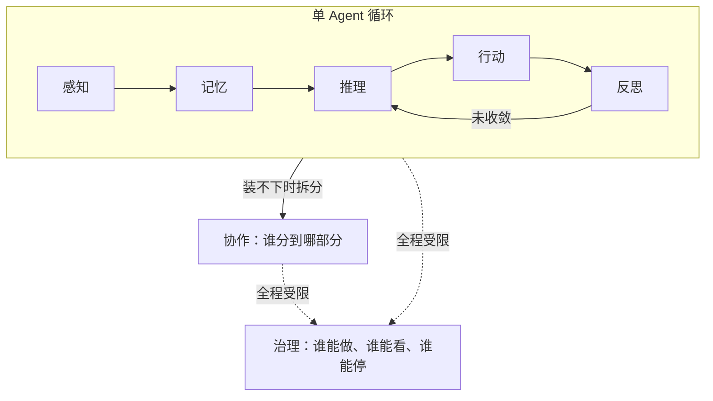

你在用 Cursor 或 Claude Code 改代码时，大概都遇到过这几种情况：喂给它整个项目的上下文，它还是没找到真正该改的那个文件；你在对话里已经明确说过"这个方案不行"，过几轮它又把同一个方案搬出来讲了一遍；你和同事分别开了一个 agent，在同一个分支上各自改代码，最后一看，两边的改动完全打起来了。


这里说的 agent，说白了就是 Cursor、Claude Code、GitHub Copilot 这类能自己读代码、自己改文件、自己跑命令的 AI 编程工具——它们和一问一答的聊天机器人不一样，是能连续自己做一串动作的。


遇到上面这类情况，我们的第一反应通常是：“这个模型还不够聪明。”但仔细拆开看，问题常常出在别处：没找到该改的文件，是项目里无关代码太多，真正相关的部分被稀释了；重复一个已被否定的方案，是该保留的结论没留下来；两处改动互相冲突，是协作时该同步的信息没有同步。它们都指向同一件事：某一种资源花错了地方。


这篇文章想聊一种看 Agent 的方式：把它拆成感知、记忆、推理、行动、反思、协作、治理七个功能。它们常被列成“Agent 应具备的能力”，看上去像一张待办清单，仿佛每一项越多越好。

工程里通常不是这么回事。每一项都有上限，超过上限后，新增的能力可能开始制造新的麻烦。


更贴近工程现场的理解是：这七个功能对应七种性质不同的预算。每一种都有稀缺资源，也有超支后的症状。于是，“更大模型、更长上下文、更多工具”不再天然等于更好的 Agent；分配不当时，它们反而会放大错误。


## 先建立直觉：预算超支的报警方式都不一样


前端工程师对“预算”两个字应该很熟。渲染最好在一帧约 16ms 内完成，稍微超一点就开始掉帧；包体多几十 KB，首屏可能就慢下来；内存持续上涨，最后会卡死甚至白屏。预算超支不是账面数字变大，而是会触发具体的报警：掉帧、卡顿、崩溃。


Agent 的七个功能也可以这样看。每一笔都有不同的稀缺资源和报警方式：


| 功能 | 对应预算 | 超支时的典型表现 |
|---|---|---|
| 感知 Perception | 注意力预算 | 信息过载，关键信号被噪声稀释 |
| 记忆 Memory | 连续性预算 | 该忘的没忘，该记的没记住 |
| 推理 Reasoning | 不确定性预算 | 简单问题用了昂贵的思考路径，慢且不一定更准 |
| 行动 Action | 不可逆预算 | 错误从"可以重答"变成"需要补偿" |
| 反思 Reflection | 校正预算 | 循环不收敛，或者自己给自己找理由 |
| 协作 Collaboration | 分工预算 | 决策分散，谁都不知道全局发生了什么 |
| 治理 Governance | 信任预算 | 能力和约束不匹配，事故半径失控 |


先有个整体轮廓。下面逐笔看看：它在管什么，怎样算超支，工程上又能放什么护栏。


## 感知：注意力预算


传统程序的输入很干脆：一个字符串、一个对象、一次接口响应，边界清清楚楚。帮你改代码的 Agent 面对的却是一整个项目、一份 Git diff、一串报错日志，还有几轮对话。它得自己判断哪些该看，哪些暂时放一边。感知管的就是这道边界。


感知出问题时，常见情况不是漏读，而是读得太多，最后等于没读。想想 Chrome DevTools 的 Performance 面板：录了 30 秒，几万条记录堆在一起，真正卡顿的那一帧被埋在正常记录里。Agent 读了三十个文件却漏掉关键文件，也是同一种失败，关键信号被其余二十九份噪声盖住了。


Anthropic 的工程团队把这件事说得很直接：模型的注意力是有限资源。Token 增加并不必然带来更多有效信息；上下文过长时，检索精度和长程推理可能逐步变差。他们给出的工程原则也很朴素：找出那一小组高信号内容，而不是把能找到的内容全塞进去。


实践上，这和前端做性能治理很像：及时丢掉不再需要的历史记录，按需加载资料，不要把所有内容一次性塞进上下文等着用。


## 记忆：连续性预算


感知解决“这一刻该看什么”，记忆解决“这一刻之后还要保留什么”。前端里，`state` 放的是这次渲染和后续交互还会用到的东西；`ref` 或局部变量往往只保存临时状态。什么都塞进 `state`，组件早晚会变成谁都不敢碰的黑箱。

LLM 的上下文窗口也更像工作台，不是仓库。历史一股脑堆进去，模型迟早会在自己的工作台上找不到东西。


有个很好理解的类比：把 LLM 当成一台操作系统，上下文窗口对应主内存（也就是 RAM），主内存之外再挂一层外部存储（对应磁盘）。模型自己决定什么留在内存里，什么换出到磁盘，什么时候再把磁盘上的内容捞回来——这和操作系统的虚拟内存分页几乎是同一套逻辑，只是做决策的从内核换成了模型自己。


这个类比指向了记忆预算真正稀缺的资源：不是存储容量，而是判断“什么值得跨时间保留”的能力。每次都把用户当陌生人的 Agent 没守住下限；把每个细节都当永久事实、从不更新或遗忘的 Agent，则会被旧信息拖住。

可召回、可更新、可遗忘，缺一项，记忆就容易从资产变成负担。


这也是为什么很多团队会把"怎么做事的经验"写成一份持久化的文档，而不是每次都指望模型在当前这轮对话里重新想明白——这份文档不属于某一次对话，是跨会话持续存在的那一层记忆，有点像你会把项目约定写进 README，而不是每次都口头讲一遍。


## 推理：不确定性预算


推理处理的是：面对眼前的信息，怎样从前提走到结论。一个常见误区是把它理解为“想得越久越可靠”。简单判断往往一步就能定，复杂问题才需要拆解、假设、验证和回看。让所有问题都走最贵的思考路径，消耗的是实打实的算力，结果也未必更好。


前端工程师对这件事也有直觉：给一个组件加 `useMemo` 或者 `useCallback`，本质上就是在做同一种判断——这次输入到底变了没有，值不值得重新算一遍。给一个输入框加防抖，也是同一件事：不是每次按键都要立刻触发一次昂贵的搜索请求，而是等用户停下来了再算。


RouteLLM 这类工作会先判断问题复杂度，再决定送给更强的模型还是成本更低的模型。它提醒我们：推理预算关心的不是抽象的“答案对不对”，而是要为消解这次不确定性花多大力气。很多问题不值得走最贵的那条路。


## 行动：不可逆预算


行动决定 Agent 能对外部世界做什么。读文件、查接口、发邮件、改代码、跑部署，表面上都是调用工具，风险却差得很远。产品设计里也有同样的判断：点错“查看”顶多刷新页面，点错“删除”可能让数据再也找不回来。所以删除通常需要二次确认，查看则不需要。GET 和 DELETE 的差别，放到 Agent 身上一样成立。


OWASP（一个专门研究应用安全的组织）在总结 AI 系统常见风险时，反复强调的问题根源是：授予 agent 的功能范围、权限范围、自主程度，只要有一项超出实际需要，模型的一次误判或者一次被诱导的指令，都可能被放大成真实世界里的破坏性动作。他们给的应对原则可以归纳成三句话：能力上只给完成任务所需的最小工具集，不要给一把"万能钥匙"；权限上用限定范围、限定时效的凭证；自主程度上，对影响大、难撤销的动作，强制要求人工点头，而且这个校验要放在下游系统里做，不能只信任模型自己说的"我觉得没问题"。


实践里，关键是按风险给动作分层：读操作可以默认放行；写操作按场景放行；真正难以撤销的操作，无论 Agent 开得多自由，都该单独拦一道。


## 反思：校正预算


反思用来检查刚才做得对不对、错在哪里、下一步怎样调整。它的价值很直接：尽早暴露错误。


楼下奶茶店换了新招牌，颜色你总觉得不太对，让隔壁做设计的朋友帮忙调一版。他调完发来看，你说好像还差点意思；他又调了一版，你说这次好像有点太艳了；他往回调了一点，你说这次挺像第一版的；他随手翻出聊天记录一看，这次的配色和三版之前几乎是同一个颜色。两人在群里对着同一张图来回发了十几次，谁都没说清楚"到底改到哪一步才算对"，只是每次都觉得"这次好像更接近了一点"。


这就是反思预算失控时的样子。对一次输出反复检查、修改，确实可能提高质量；生成、评判、再生成的循环也有研究支持。但它有很明确的失败模式：评判者总能挑出“还可以再改改”的地方。没有停止信号，循环会原地打转，越改越乱，也容易变成自我说服。


所以反思循环必须有清楚的终止条件、可核验的判断标准，必要时还要有模型之外、真正说了算的事实依据——就像前面那个招牌的故事，如果两人一开始就定好"改到 Pantone 色号对上就停"，而不是各自凭感觉说"好像更接近了"，这场来回拉锯根本不会发生。


## 协作：分工预算


当一个 Agent 装不下任务时，协作就开始介入。开头提到两个 Agent 同时改同一分支、最后改动互相冲突，就是协作预算最常见的事故现场。

协作带来的收益是专业化和隔离。读代码的 Agent 不必拿到写文档的全部上下文，跑测试的 Agent 也不该拥有生产环境的写权限。协作失败时，往往不是信息不够，而是所有人都知道太多、决策权又散得到处都是，最后没人为全局兜底。


这里有两种真实的工程经验值得放在一起看。做研究型任务的团队发现，把一个大任务拆给好几个相互独立的 agent 并行推进，能把耗时压缩到原来的一小部分——前提是这些 agent 探索的方向天然互不干扰，不需要协调同一份共享产物。但做代码类任务的团队给出了几乎相反的警告：如果多个 agent 各自对同一份代码做决策，又没有充分共享彼此的判断依据，系统会变得很脆弱——每个 agent 都在不了解全局的情况下做了局部合理的选择，合到一起却互相打架。


这两种经验合在一起看，判断标准就清楚了：能否把决策权真的切开。探索型、产物互不干扰的任务很适合并行；多人同时改同一份共享产物、又需要连续决策时，先要说清“谁最后拍板”。

所以多人用 Agent 改同一个项目时，通常更稳的是各自在独立的工作区（Git worktree）修改，再把结果汇合，而不是同时在同一份代码上直接下手。


## 治理：信任预算


治理关心的是：Agent 的能力怎样限制、记录、审查和追责。它听起来像合规文档，真正生效的却是每个动作旁边的运行时机制。


公司新来的实习生入职第一天，行政图省事，直接把她拉进了和产品经理、技术负责人同一个权限组——财务系统能看，客户联系方式能查，对外发邮件的权限也顺手一起给了。上岗第三天，她收到一封"供应商对账单"的邮件，附件是个填了一半的表格，备注写着"麻烦补充一下联系人信息，方便财务尽快打款"。她照着邮件里的说明，把几个客户的联系方式填进去，顺手用工作邮箱发了回去。


这个场景里没有哪一步是"她故意做错事"——每一步单独看都很正常。真正的问题出在最开始的权限分配：她同时具备了三个条件——能接触到敏感数据、会接触到不可信的外部内容（那封邮件）、还有对外发送信息的能力。这三个条件叠在一起，任何一次看起来正常的输入，都可能变成一次数据泄露。研究 AI 安全的人给这个组合起了个名字，叫"致命三件套"——私有数据、不可信内容、对外通信，三者同时具备时，风险不是三者相加，是相乘。


治理预算的代价往往是非线性的。权限多给一点、审批少一道，平时可能什么事都没有；某次不可信输入刚好撞上那道没设的门，事故半径就出来了。

一些 AI 编程工具会在执行前强制拦截危险操作，例如删除生产分支、强推主干。它们把拒绝放在允许之前。这里的关键不是把确认全部关掉，而是让工具本身在高风险处守住边界，别指望模型每次都保持警惕。


## 预算之间会互相挤占


七笔预算不是各自独立记账的。真实系统里，它们经常此消彼长：


```text
任务总代价 = 感知代价 + 记忆代价 + 推理代价 + 行动风险 + 反思轮次 + 协作开销 + 治理摩擦
```


这个公式不用于精确计算，只是提醒我们：预算之间会互相挤占。反思多循环一轮，等于多花一轮推理；协作的 Agent 越多，需要治理覆盖的权限边界也越多；感知阶段收得太紧，遗漏了关键信息，后续推理只能在残缺的前提上打转，最后还得用更多反思来补。





图里有三层结构：感知、记忆、推理、行动、反思构成单个 Agent 的内部循环；单个循环装不下任务时，协作负责把任务分给更多循环；治理包在外层，决定每个动作能否被看见、拦下和追责。

设计 Agent 系统时，可以少问一句“七个能力都齐了吗”，多问三件具体的事：循环内的五笔预算够不够，协作这道分流阀该不该打开，外层约束有没有跟上能力扩张。


## 小结


七个认知功能更像七种资源预算：


- 感知管注意力。超支常表现为信息过载。
- 记忆管的是跨时间的连续性，价值在可召回、可更新、可遗忘，不在存了多少。
- 推理管为消解不确定性该花多少计算力气，大多数问题不需要最贵的路径。
- 行动管的是撤不撤得回来的风险，错误能不能被重来，决定了这笔预算该收多紧。
- 反思管自我纠偏；没有终止条件和外部事实依据，就会变成自我说服。
- 协作管的是能不能真的把决策权切开、隔离，切不开的任务，协作只会让噪声翻倍。
- 治理管信任边界。它的代价是非线性的，出事时往往很难收场。


好的 Agent 系统设计，不是把每一笔预算都拉满，而是让它刚好够用，并提前想清楚：真的超支时，系统会怎样收场。


## 参考资料


正文里提到的几个来源，汇总在这里，感兴趣可以顺着链接继续看：


- Anthropic，[Effective context engineering for AI agents](https://www.anthropic.com/engineering/effective-context-engineering-for-ai-agents) —— 感知部分提到的"有限注意力"和 context rot
- Packer et al.，[MemGPT: Towards LLMs as Operating Systems](https://arxiv.org/abs/2310.08560) —— 记忆部分提到的操作系统内存分层类比
- [RouteLLM](https://arxiv.org/abs/2406.18665) —— 推理部分提到的复杂度路由，用便宜模型处理简单问题
- OWASP，[LLM06:2025 Excessive Agency](https://owasp.org/www-project-top-10-for-large-language-model-applications/2_0_vulns/LLM06_ExcessiveAgency.html) —— 行动 / 治理部分提到的最小权限原则
- Shinn et al.，[Reflexion: Language Agents with Verbal Reinforcement Learning](https://arxiv.org/abs/2303.11366) —— 反思部分提到的生成-评判循环
- Anthropic，[How we built our multi-agent research system](https://www.anthropic.com/engineering/multi-agent-research-system) 与 Cognition，[Don't Build Multi-Agents](https://cognition.ai/blog/dont-build-multi-agents) —— 协作部分提到的两种相反的工程经验
- Simon Willison，[The lethal trifecta for AI agents](https://simonwillison.net/2025/Jun/16/the-lethal-trifecta/) —— 治理部分提到的"致命三件套"
