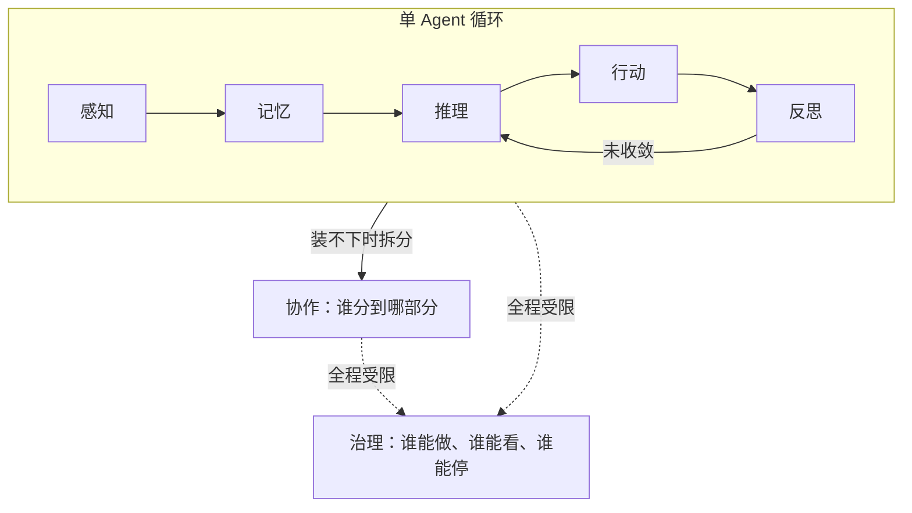

你在用 Cursor 或 Claude Code 改代码时，大概都遇到过这几种情况：喂给它整个项目的上下文，它还是没找到真正该改的那个文件；你在对话里已经明确说过"这个方案不行"，过几轮它又把同一个方案搬出来讲了一遍；你和同事分别开了一个 agent，在同一个分支上各自改代码，最后一看，两边的改动完全打起来了。


这里说的 agent，说白了就是 Cursor、Claude Code、GitHub Copilot 这类能自己读代码、自己改文件、自己跑命令的 AI 编程工具——它们和一问一答的聊天机器人不一样，是能连续自己做一串动作的。


遇到上面这类情况，我们的第一反应通常是"这个模型不够聪明"。但仔细拆开看，这几个场景的锅经常不在模型能力上：没找到该改的文件，是因为项目里无关的代码太多，真正相关的那部分被稀释了；重复了已经否定过的方案，是因为该被记住的结论没有被记住；两处改动打起来，是因为协作时该同步的信息没有同步。这些都不是"不够聪明"，是**某一种资源被花错了地方**。


这篇文章想聊的，是 Agent 领域一个越来越常见的拆解方式：把 Agent 的能力拆成感知、记忆、推理、行动、反思、协作、治理七个功能。这七个词经常被当成一张"Agent 应该具备哪些能力"的清单来讲，但清单式的讲法有个隐患——它暗示每一项都是越多越好。现实里几乎每一项都有一个隐藏的天花板，过了这个天花板，多出来的部分不是白费，而是倒扣分。


更准确的理解是，这七个功能对应七种性质完全不同的**预算**：每一种都有自己独特的稀缺资源，也都有自己独特的超支表现。搞懂"预算"和"能力清单"的区别，才能搞懂为什么给 Agent 更大的模型、更长的上下文、更多的工具，有时候反而会让它表现更差。


## 先建立直觉：预算超支的报警方式都不一样


前端工程师对"预算"这两个字应该有种本能的敏感。渲染要在 16 毫秒左右的这一帧里跑完，多花一点就掉帧；打包体积卡在一个数字以内，多几十 KB 首屏就明显变慢；内存不能没有上限地涨，涨过一定量页面直接卡死甚至白屏。这些预算有个共同点：超支从来不是"多花一点也无所谓"，而是有一个具体的、往往还挺突然的报警——掉帧、卡顿、崩溃。


Agent 的七个能力，可以用同一个视角理解。它们不是"越强越好"的一张能力清单，是七种性质不同的预算，各自有自己的稀缺资源，也各自有自己独特的报警方式：


| 功能 | 对应预算 | 超支时的典型表现 |
|---|---|---|
| 感知 Perception | 注意力预算 | 信息过载，关键信号被噪声稀释 |
| 记忆 Memory | 连续性预算 | 该忘的没忘，该记的没记住 |
| 推理 Reasoning | 不确定性预算 | 简单问题用了昂贵的思考路径，慢且不一定更准 |
| 行动 Action | 不可逆预算 | 错误从"可以重答"变成"需要补偿" |

| 功能 | 对应预算 | 超支时的典型表现 |
|---|---|---|
| 反思 Reflection | 校正预算 | 循环不收敛，或者自己给自己找理由 |
| 协作 Collaboration | 分工预算 | 决策分散，谁都不知道全局发生了什么 |
| 治理 Governance | 信任预算 | 能力和约束不匹配，事故半径失控 |


这张表先给一个整体轮廓，接下来逐个拆开看，每一笔预算具体在管什么、什么时候会超支、工程上怎么设护栏。


## 感知：注意力预算


传统程序的输入很干脆：一个字符串、一个对象、一次接口的响应体，边界清清楚楚。Agent 的输入不是这样。一个帮你改代码的 agent 要面对的，是一整个项目、一份 git diff、一串报错日志、你们来回聊了几轮的对话——这些东西天然没有边界，需要 agent 自己判断"哪些该看，哪些可以先放一边"。感知，就是在管这道边界。


这里有个容易被忽略的地方：感知出问题的典型表现，往往不是"没看到该看的"，而是"看了太多，等于什么都没看到"。这个场景你可能更熟——打开 Chrome DevTools 的 Performance 面板录了 30 秒，几万条记录堆在一起，真正卡顿的那一帧被埋在一堆正常记录里，翻半天都找不到。Agent 读了三十个文件却漏掉真正相关的那一个，是同一种失败：读的动作本身没有意义，因为关键信号被剩下二十九份噪声盖住了。


Anthropic 的工程团队写过一篇很实在的文章，把这件事总结得很直白：模型的注意力是一种有限资源，塞进去的 token 越多不代表信息越多，反而会让检索精度和长程推理能力慢慢打折——不是一下子失灵，是随着上下文变长逐渐变糟。他们给的工程原则也很朴素：找到能让结果最靠谱的、最小的一组高信号内容，而不是"能塞的都塞进去"。


落到实践里，对应的做法和前端处理性能问题时的思路很像：该丢的历史记录及时丢掉（类似清理不再需要的缓存），该按需加载的东西按需加载（类似路由懒加载），而不是一次性把所有东西都塞进内存里等着用。


## 记忆：连续性预算


感知回答"这一刻该看什么"，记忆回答"这一刻之后，还要不要接着知道"。这里前端工程师应该很有共鸣：state 放的是"这次渲染要用、以后可能还要用"的东西；ref 或者局部变量放的是"用一次就可以扔"的东西；如果什么都塞进 state，组件迟早变成一个谁都不敢碰的黑箱。LLM 的上下文窗口也是同一个道理——它是工作台，不是仓库，把所有历史都往上堆，迟早堆到连它自己都找不到东西。


有个很好理解的类比：把 LLM 当成一台操作系统，上下文窗口对应主内存（也就是 RAM），主内存之外再挂一层外部存储（对应磁盘）。模型自己决定什么留在内存里，什么换出到磁盘，什么时候再把磁盘上的内容捞回来——这和操作系统的虚拟内存分页几乎是同一套逻辑，只是做决策的从内核换成了模型自己。


这个类比说清楚了记忆预算真正稀缺的资源是什么：不是"存储容量"，而是"什么值得跨时间保留"。一个每次都把你当陌生人的 agent 没有成长，这是记忆的下限没守住；但一个把每个细节都当永久事实、从不更新也不遗忘的 agent，会被自己攒的旧信息拖死，这是记忆的上限被击穿。可召回、可更新、可遗忘，三者缺一个，记忆就从资产变成了负债。


这也是为什么很多团队会把"怎么做事的经验"写成一份持久化的文档，而不是每次都指望模型在当前这轮对话里重新想明白——这份文档不属于某一次对话，是跨会话持续存在的那一层记忆，有点像你会把项目约定写进 README，而不是每次都口头讲一遍。


## 推理：不确定性预算


推理回答的是"面对眼前的信息，怎么从前提走到结论"。这里最容易踩的坑，是把"推理"简单理解成"想得越久越靠谱"。真实情况是，简单判断往往一步就能定，复杂问题才需要拆解、假设、验证、回头看；如果让所有问题都走一遍最贵的思考流程，多花的不是耐心，是真金白银的算力，而且不一定换来更好的结果。


前端工程师对这件事也有直觉：给一个组件加 `useMemo` 或者 `useCallback`，本质上就是在做同一种判断——这次输入到底变了没有，值不值得重新算一遍。给一个输入框加防抖，也是同一件事：不是每次按键都要立刻触发一次昂贵的搜索请求，而是等用户停下来了再算。


有团队做过一个轻量的分类器，先判断一个问题的复杂程度，再决定是送去更贵的强模型，还是够用的便宜模型——公开的测试结果显示，这样能在效果几乎不掉的情况下，把成本压低了一大截。这个思路说的其实是同一件事：推理预算买的不是"答案对不对"，买的是"要花多大力气去把这次的不确定消掉"，而大多数问题根本不需要消到最彻底。


## 行动：不可逆预算


行动回答"agent 能对这个世界做什么，以及怎么做"。读一个文件、查一次接口、发一封邮件、改一段代码、跑一次部署，这些动作表面上都是"调用一下"，但风险完全不是一个量级。这个道理前端工程师做产品设计时天天在用：查看按钮点错了顶多刷新页面，删除按钮点错了可能就是一条数据再也找不回来了——这就是为什么删除通常要二次确认，查看从来不用。GET 请求和 DELETE 请求在语义上的这层差异，搬到 agent 身上是一模一样的问题。


OWASP（一个专门研究应用安全的组织）在总结 AI 系统常见风险时，反复强调的问题根源是：授予 agent 的功能范围、权限范围、自主程度，只要有一项超出实际需要，模型的一次误判或者一次被诱导的指令，都可能被放大成真实世界里的破坏性动作。他们给的应对原则可以归纳成三句话：能力上只给完成任务所需的最小工具集，不要给一把"万能钥匙"；权限上用限定范围、限定时效的凭证；自主程度上，对影响大、难撤销的动作，强制要求人工点头，而且这个校验要放在下游系统里做，不能只信任模型自己说的"我觉得没问题"。


落到实践，行动预算的核心从来不是"要不要让 agent 做事"，而是"把不同风险量级的动作分层管理"：读操作默认放行，写操作看情况放行，真正撤不回的操作，不论 agent 处在多自由的模式下，都该单独拦一道。


## 反思：校正预算


反思回答"刚才做得对不对、错在哪、下一步怎么改"。它的价值很直接——把错误尽早暴露出来，而不是让结果显得更漂亮。


楼下奶茶店换了新招牌，颜色你总觉得不太对，让隔壁做设计的朋友帮忙调一版。他调完发来看，你说好像还差点意思；他又调了一版，你说这次好像有点太艳了；他往回调了一点，你说这次挺像第一版的；他随手翻出聊天记录一看，这次的配色和三版之前几乎是同一个颜色。两人在群里对着同一张图来回发了十几次，谁都没说清楚"到底改到哪一步才算对"，只是每次都觉得"这次好像更接近了一点"。


这基本就是反思预算失控时的样子。让 agent 对着一次输出反复检查、反复修改，确实能提高质量——生成、评判、再生成的循环，已经在不少研究里证明比一次性生成更稳。但这个循环有个明确的失败模式：评判者（哪怕是它自己）永远能挑出一个"可以再改改"的地方，没有停止信号，循环只会原地打转，越改越乱，还很容易自己给自己找理由说"这次是对的"。


所以反思循环必须有清楚的终止条件、可核验的判断标准，必要时还要有模型之外、真正说了算的事实依据——就像前面那个招牌的故事，如果两人一开始就定好"改到 Pantone 色号对上就停"，而不是各自凭感觉说"好像更接近了"，这场来回拉锯根本不会发生。


## 协作：分工预算


协作回答"一个 agent 装不下的任务，怎么拆给多个 agent"。开头提到的"你和同事分别开了一个 agent，在同一个分支上改代码，回来一看两边打起来了"，就是协作预算最常见的翻车现场。协作买的不是"人多力量大"，买的是专业化和隔离——读代码的 agent 不需要拿到写文档的全部上下文，跑测试的 agent 不需要拥有生产环境的写权限。协作失败最典型的样子，恰恰和感知失败反过来：不是信息不够，是"大家都知道一切，所以大家都被淹没在噪声里"，决策权散得到处都是，谁都没有真正兜底。


这里有两种真实的工程经验值得放在一起看。做研究型任务的团队发现，把一个大任务拆给好几个相互独立的 agent 并行推进，能把耗时压缩到原来的一小部分——前提是这些 agent 探索的方向天然互不干扰，不需要协调同一份共享产物。但做代码类任务的团队给出了几乎相反的警告：如果多个 agent 各自对同一份代码做决策，又没有充分共享彼此的判断依据，系统会变得很脆弱——每个 agent 都在不了解全局的情况下做了局部合理的选择，合到一起却互相打架。


这两种经验放在一起，说的是同一件事：协作预算值不值得花，不取决于"人多不多"，取决于"能不能真正把决策权切开"。探索型、结果互相独立的任务，并行几乎是免费的性能提升；涉及同一份共享产物、需要连续决策的任务，协作预算花出去的每一分，都要先问一句"最后拍板的到底是谁"。这也是为什么多人一起用 agent 改同一个分支时，更稳的做法通常是每个 agent 各自开一个独立的工作区（git worktree）分开改，而不是让它们同时在同一份代码上各自下手。


## 治理：信任预算


治理回答"agent 的能力要怎么被限制、记录、审查、追责"。这句话听起来像一份合规文档，但治理真正生效的地方，是和每一次动作绑在一起的运行时机制，不是事后补一份说明。


公司新来的实习生入职第一天，行政图省事，直接把她拉进了和产品经理、技术负责人同一个权限组——财务系统能看，客户联系方式能查，对外发邮件的权限也顺手一起给了。上岗第三天，她收到一封"供应商对账单"的邮件，附件是个填了一半的表格，备注写着"麻烦补充一下联系人信息，方便财务尽快打款"。她照着邮件里的说明，把几个客户的联系方式填进去，顺手用工作邮箱发了回去。


这个场景里没有哪一步是"她故意做错事"——每一步单独看都很正常。真正的问题出在最开始的权限分配：她同时具备了三个条件——能接触到敏感数据、会接触到不可信的外部内容（那封邮件）、还有对外发送信息的能力。这三个条件叠在一起，任何一次看起来正常的输入，都可能变成一次数据泄露。研究 AI 安全的人给这个组合起了个名字，叫"致命三件套"——私有数据、不可信内容、对外通信，三者同时具备时，风险不是三者相加，是相乘。


这也是为什么治理这笔预算不太一样。其他六笔预算超支，代价通常是慢一点、乱一点，但治理预算超支的代价是非线性的——多给一点权限、少加一道审批，平时可能什么事都不会发生，直到某一次不可信输入刚好撞上了那道没设的门。现在不少 AI 编程工具已经开始在动作执行前加一层强制拦截——不管你开不开自动模式，危险操作（比如删除生产分支、强推主干）总会被单独拦一道，拒绝的判定优先级比"允许"更高。这也印证了同一个道理：好的自主，从来不是关掉确认，是把安全前移到工具本身的机制里，而不是指望模型自己保持警惕。


## 预算之间会互相挤占


七笔预算不是各自独立记账的。真实系统里，它们经常此消彼长：


```text
任务总代价 = 感知代价 + 记忆代价 + 推理代价 + 行动风险 + 反思轮次 + 协作开销 + 治理摩擦
```


这个公式不是用来精确计算的，是用来提醒一件容易被忽略的事——多花一笔预算，通常意味着少花另一笔，不是白得的。反思多循环一轮，本质是又花了一轮推理预算；协作拆出去的 agent 越多，需要治理覆盖的权限边界就越多，治理预算跟着往上涨；感知阶段收得太紧，短期看是省了注意力预算，但真正需要的信息没进来，后面的推理只能在残缺的前提上打转，反而要靠更多轮反思来补。





这张图想说明的结构是：感知、记忆、推理、行动、反思这五个功能，构成一个 agent 自己内部真正在转的那个循环；协作是这个循环"一个人装不下"时的分流阀，把任务切给更多循环去跑；治理不在循环内部，是包在外面的一层约束，决定循环里发生的每件事能不能被看见、被拦下、被追责。设计一个 agent 系统时，与其问"这七个能力都做到位了吗"，更准确的问法是"这五笔循环内的预算够不够用，分流阀该不该打开，外层的约束有没有跟上能力的扩张"。


## 小结


七个认知功能不是一张越丰满越好的能力清单，是七种性质完全不同的资源预算：


- 感知管的是注意力，超支的表现是信息过载，不是信息不足。
- 记忆管的是跨时间的连续性，价值在可召回、可更新、可遗忘，不在存了多少。
- 推理管的是要不要为消解不确定性多花计算力气，大多数问题不需要最贵的那条路径。
- 行动管的是撤不撤得回来的风险，错误能不能被重来，决定了这笔预算该收多紧。
- 反思管的是自我纠偏，但没有终止条件和外部的事实依据，反思会变成自我说服。
- 协作管的是能不能真的把决策权切开、隔离，切不开的任务，协作只会让噪声翻倍。
- 治理管的是信任的边界，它的代价是非线性的，平时看不出来，出事就是一次说不清的大问题。


好的 agent 系统设计，从来不是让每一笔预算都尽量大，而是让每一笔预算刚好够用，并且在设计阶段就想清楚，一旦某一笔真的超支，系统会怎么收场。


## 参考资料


正文里提到的几个来源，汇总在这里，感兴趣可以顺着链接继续看：


- Anthropic，[Effective context engineering for AI agents](https://www.anthropic.com/engineering/effective-context-engineering-for-ai-agents) —— 感知部分提到的"有限注意力"和 context rot
- Packer et al.，[MemGPT: Towards LLMs as Operating Systems](https://arxiv.org/abs/2310.08560) —— 记忆部分提到的操作系统内存分层类比
- [RouteLLM](https://arxiv.org/abs/2406.18665) —— 推理部分提到的复杂度路由，用便宜模型处理简单问题
- OWASP，[LLM06:2025 Excessive Agency](https://owasp.org/www-project-top-10-for-large-language-model-applications/2_0_vulns/LLM06_ExcessiveAgency.html) —— 行动 / 治理部分提到的最小权限原则
- Shinn et al.，[Reflexion: Language Agents with Verbal Reinforcement Learning](https://arxiv.org/abs/2303.11366) —— 反思部分提到的生成-评判循环
- Anthropic，[How we built our multi-agent research system](https://www.anthropic.com/engineering/multi-agent-research-system) 与 Cognition，[Don't Build Multi-Agents](https://cognition.ai/blog/dont-build-multi-agents) —— 协作部分提到的两种相反的工程经验
- Simon Willison，[The lethal trifecta for AI agents](https://simonwillison.net/2025/Jun/16/the-lethal-trifecta/) —— 治理部分提到的"致命三件套"


如果你对这套预算怎么在更具体的工程场景里落地感兴趣，可以接着看[趣谈 Skill 中的执行拓扑](/talks/execution-topology-in-skills/)和[Agent 的 HITL 与 YOLO](/talks/agent-hitl-vs-yolo/)这两篇——里面讲的编排模式和自主程度，分别是协作预算和治理预算的具体落地写法。
