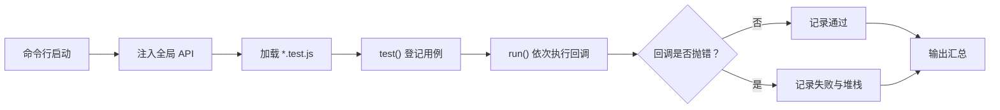
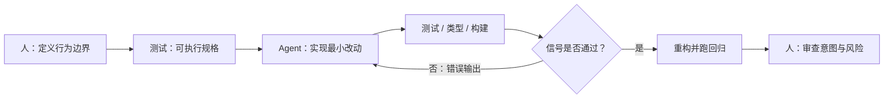

日常写测试时，很多 API 已经熟得像条件反射：

```js
test('加法正确', () => {
  expect(sum(3, 7)).toBe(10)
})
```

再复杂一点，会有 `beforeEach`、`jest.fn()`、`vi.mock()`、测试报告、覆盖率和 watch mode。工具把细节收得很好，带来的副作用是：`test` 何时真正开始跑、异步为什么能等住、Mock 怎样留下调用记录，反而不容易说清。

现在的选择也比几年前多了：Jest 仍是成熟方案，Vitest 和 Vite 的模块体系结合得更紧，Node 自己也提供了 `node:test`。本文用一个 CommonJS 小框架把共同骨架摊开：测试怎样登记、怎样执行，失败怎样一路传回报告，Mock 又从哪里插进来。

## 先看最终要跑的测试

先从使用者视角出发。假设有一个工具模块：

```js
// math.js
function sum(a, b) {
  return a + b
}

function sumAsync(a, b) {
  return Promise.resolve(sum(a, b))
}

module.exports = { sum, sumAsync }
```

测试文件希望写成这样：

```js
// math.test.js
const { sum, sumAsync } = require('./math')

test('sum 可以相加', () => {
  expect(sum(3, 7)).toBe(10)
})

test('sumAsync 可以等待', async () => {
  await expect(sumAsync(3, 7)).resolves.toBe(10)
})
```

这里最容易产生的误会是：`test()` 在“运行测试”。

其实它更像餐厅前台拿到一张订单。测试文件被加载时，`test('sum 可以相加', callback)` 立刻执行，但它先把标题和回调登记起来，不急着调用回调。等所有测试文件都加载完，Runner 再按顺序处理这些订单。

如果 `test()` 登记完就立刻执行，测试文件的加载顺序、后续的钩子函数和最终统计都会缠在一起。先登记，后执行，Runner 才有地方安排它们。

```text
测试框架 = 用例登记 + 统一执行 + 失败上报 + 结果汇总
```

## 测试 Runner：先登记，再执行

先做一个最小的用例仓库。`test` 只负责往里面放数据：

```js
// framework/runner.js
const cases = []

function test(title, callback) {
  cases.push({ title, callback })
}

async function run() {
  const results = []

  for (const { title, callback } of cases) {
    const startedAt = performance.now()

    try {
      await callback()
      results.push({
        title,
        status: 'passed',
        duration: performance.now() - startedAt,
      })
      console.log(`✓ ${title}`)
    } catch (error) {
      results.push({
        title,
        status: 'failed',
        error,
        duration: performance.now() - startedAt,
      })
      console.error(`✕ ${title}`)
      console.error(error.stack ?? error)
    }
  }

  return results
}

module.exports = { test, run }
```

`await callback()` 把同步和异步收进了同一条路径：普通函数直接结束，Promise 则等到 fulfilled 或 rejected。超时、并发、`done` 回调这些能力，都是继续回答同一个问题：这条用例到底什么时候算结束。

加载测试文件和执行测试用例很容易混淆，画出来会直观一些：



`require(testFile)` 只负责登记，`run()` 才会调用回调。这个边界后面会不断出现：钩子、筛选、并发和报告都挂在这里。

## 断言库：成功时沉默，失败时抛错

Runner 知道怎样执行回调了，但它还不知道“正确”是什么。这个判断交给断言库。

最简单的 `expect` 可以只有一个 matcher：

```js
// framework/expect.js
function expect(actual) {
  return {
    toBe(expected) {
      if (!Object.is(actual, expected)) {
        throw new Error(
          `Expected ${String(actual)} to be ${String(expected)}`
        )
      }
    },
  }
}

module.exports = { expect }
```

`toBe` 使用 `Object.is`，因此它的语义是“是不是同一个值”。例如两个内容相同但分别创建的对象不会通过：

```js
expect({ name: 'Suri' }).toBe({ name: 'Suri' }) // 失败
```

这不是框架故意刁难，而是 JavaScript 的对象引用本来就不同。要比较对象结构，需要另一个 matcher，例如用 Node.js 自带的 `assert.deepStrictEqual` 包一层：

```js
const assert = require('node:assert/strict')

function toEqual(actual, expected) {
  try {
    assert.deepStrictEqual(actual, expected)
  } catch {
    throw new Error(
      `Expected ${JSON.stringify(actual)} to deeply equal ` +
      JSON.stringify(expected)
    )
  }
}
```

为什么失败要 `throw`，而不是 `return false`？

因为 Runner 已经把“回调正常结束视为通过，回调抛错视为失败”定义成统一协议。断言失败时抛错，错误会自然沿着测试回调向上传到 Runner；用例标题、错误堆栈、耗时这些上下文，也能在同一个地方统一记录。断言库不需要认识 Runner，Runner 也不用认识每一种断言，它们只通过 Error 这个很朴素的边界合作。

> Jest 的 `expect` 体系比这里丰富得多，包括非对称匹配、快照、异步 matcher 和自定义 matcher。不过“matcher 不满足预期就让当前测试失败”这条协议没有变，详见 [Jest Expect 文档](https://jestjs.io/docs/expect)。

### Promise 断言只是把等待放进链条

前面的 `sumAsync` 返回 Promise。我们希望测试读起来是：

```js
await expect(sumAsync(3, 7)).resolves.toBe(10)
```

它不需要另一套断言模型，只需要先等待实际值，再复用已有的 `toBe`：

```js
function expect(actual) {
  return {
    toBe(expected) {
      if (!Object.is(actual, expected)) {
        throw new Error(`Expected ${actual} to be ${expected}`)
      }
    },

    resolves: {
      async toBe(expected) {
        const resolved = await actual
        if (!Object.is(resolved, expected)) {
          throw new Error(`Expected ${resolved} to be ${expected}`)
        }
      },
    },
  }
}
```

这里有一个很常见的坑：

```js
// 这段代码可能在 Promise 失败前就让测试结束了
expect(sumAsync(3, 7)).resolves.toBe(10)
```

`resolves.toBe()` 本身会返回 Promise。只有把它 `await` 或 `return` 出去，Runner 的 `await callback()` 才知道该等多久。异步测试的关键不是“代码里出现了 Promise”，而是要把 Promise 接回 Runner 的等待链条。

## 自动注入：为什么测试文件里没有 import

现在有了 `test` 和 `expect`，但测试文件怎么拿到它们？最直白的做法是每个文件手动引入：

```js
const { test } = require('./framework/runner')
const { expect } = require('./framework/expect')
```

能用，只是有点吵。测试框架通常会在加载测试文件前，把这些 API 放到全局对象上：

```js
// framework/cli.js
#!/usr/bin/env node

const path = require('node:path')
const { test, run } = require('./runner')
const { expect } = require('./expect')

global.test = test
global.expect = expect

const files = process.argv.slice(2)
for (const file of files) {
  require(path.resolve(process.cwd(), file))
}

run().then((results) => {
  const passed = results.filter((item) => item.status === 'passed').length
  const failed = results.length - passed

  console.log(`\nTests: ${passed} passed, ${failed} failed, ${results.length} total`)
  process.exitCode = failed === 0 ? 0 : 1
})
```

此时运行：

```bash
node framework/cli.js math.test.js
```

会先加载 `math.test.js`，里面的两次 `test()` 只是在 `cases` 数组里登记两条记录；文件加载完成后才进入 `run()`。这就是测试 API “看起来凭空存在”的最小解释。

真实框架会尽量减少全局污染，也会为每个测试文件提供隔离环境。Jest 和 Vitest 可以配置全局 API；`node:test` 则常见 `import { test } from 'node:test'` 的显式写法。这里直接写 `global`，只是为了把机制露出来，不建议把它原样带进业务项目。

## 函数 Mock：给调用留一份账本

测试纯函数很轻松：输入固定，输出大多也固定。现实里的函数却经常依赖网络、时间、随机数、埋点或另一个模块。单元测试不该为了验证自己的业务逻辑，顺带真的发一次请求、真的生成一串随机 ID。

这时需要 Mock。先别把它想得太神秘，函数 Mock 的核心就是一个代理函数加一本账：

```js
function fn(implementation = () => undefined) {
  function mockFn(...args) {
    mockFn.mock.calls.push(args)

    try {
      const value = implementation(...args)
      mockFn.mock.results.push({ type: 'return', value })
      return value
    } catch (error) {
      mockFn.mock.results.push({ type: 'throw', value: error })
      throw error
    }
  }

  mockFn.mock = {
    calls: [],
    results: [],
  }

  return mockFn
}
```

使用时，原实现仍然可以保留，额外的 `mock` 字段只负责记录历史：

```js
const sum = (a, b) => a + b
const sumMock = fn(sum)

sumMock(3, 7)

expect(sumMock.mock.calls.length).toBe(1)
expect(sumMock.mock.calls[0]).toEqual([3, 7])
expect(sumMock.mock.results[0].value).toBe(10)
```

可以把它理解成快递柜的出入记录：快递员（调用方）还是把包裹交给原来的收件流程（`implementation`），但柜子额外记下了谁什么时候放了什么。`toHaveBeenCalledTimes` 检查的是记录条数，`toHaveBeenCalledWith` 检查的是其中一条记录的参数。

这里也顺手校准一个容易写错的语义。`toHaveBeenCalledWith(3, 7)` 的意思通常是“至少有一次调用的参数等于 `[3, 7]`”，不是“每次调用都必须是 `[3, 7]`”。因此最小实现应当用 `some`：

```js
function toHaveBeenCalledWith(mockFn, expectedArgs) {
  const matched = mockFn.mock.calls.some((args) => {
    try {
      assert.deepStrictEqual(args, expectedArgs)
      return true
    } catch {
      return false
    }
  })

  if (!matched) {
    throw new Error('Expected mock function to receive the expected arguments')
  }
}
```

这个小细节其实很能说明测试框架的难处：框架代码未必复杂，难的是把一句自然语言 API 的边界定义准确。

## 模块 Mock：在依赖被加载前换掉它

函数 Mock 是手里已经有一个函数，再给它包一层。模块 Mock 要处理的是另一件事：被测模块内部 `require('uuid')` 了依赖，我们不想让它拿到真实的 `uuid`。

在 CommonJS 的最小模型里，`require()` 加载过的模块会被缓存。可以在目标模块加载前，把缓存位置替换成自己的导出对象：

```js
// user.test.js
const uuidPath = require.resolve('uuid')

require.cache[uuidPath] = {
  id: uuidPath,
  filename: uuidPath,
  loaded: true,
  exports: {
    v4: () => 'fake-user-id',
  },
}

const { createUser } = require('./user')

test('createUser 使用可预测的 id', () => {
  expect(createUser({ name: 'Suri' })).toEqual({
    id: 'fake-user-id',
    name: 'Suri',
  })
})
```

这段代码的因果关系只有两步：

1. `user.js` 还没加载时，先让 `uuid` 的缓存指向测试替身。
2. `user.js` 再执行 `require('uuid')` 时，拿到的就是替身导出。

因此顺序不能反过来。如果先 `require('./user')`，`user.js` 已经把真实 `uuid` 保存下来了，后面再改缓存也影响不到已经发生的绑定。

> Node.js 官方文档说明了 CommonJS 模块会按解析后的文件名缓存；这正是这个演示能成立的前提。[Modules: Caching](https://nodejs.org/api/modules.html#caching)。不过缓存替换只是为了讲清模型，真实项目应优先使用 Jest/Vitest 提供的 mock API。

也可以换个角度看这件事：Mock 并不是“伪造一个值”这么简单，它是在被测代码和外部世界之间插入一扇门。门后面可以是固定返回值、记录调用的代理，或者会故意抛错的异常场景。测试由此获得可控性。

## 到了 ESM 时代，Mock 不再只是改缓存

上面那段 `require.cache` 代码很适合解释 CommonJS，但它不是今天所有模块 Mock 的通用实现。前端项目大多已经写成 ESM：

```js
import { v4 as uuid } from 'uuid'
```

ESM 的静态 `import` 会在模块正文执行前完成解析和链接。也就是说，下面这种“先执行一段注册 Mock 的代码，再让静态 import 生效”的直觉，本身就不成立：

```js
// 静态 import 已经先于这里的代码完成
vi.mock('uuid', () => ({ v4: () => 'fake-user-id' }))
import { v4 } from 'uuid'
```

不同工具对这个限制给出了不同实现，但都在解决同一个时序问题：**替身必须在被测模块读取依赖之前准备好。**

| 环境 | 函数 Mock | 模块 Mock 的关键机制 |
|---|---|---|
| 手写 CommonJS Runner | 代理函数记录 `calls` | 在 `require()` 前替换 `require.cache`，仅用于理解模型 |
| Jest + CommonJS | `jest.fn()` | `jest.mock()` 可在模块加载前注册替身 |
| Jest + ESM | `jest.fn()` | 用 `jest.unstable_mockModule()` 注册，再用动态 `import()` 加载被测模块 |
| Vitest + ESM | `vi.fn()` | Vite 的转换器将 `vi.mock()` 提升，并把静态 import 改造成可在 Mock 注册后加载的形式 |
| Node `node:test` | `t.mock.fn()` / `t.mock.method()` | 函数和方法 Mock 已内置；模块 Mock 仍属于 Early development，需要显式开启实验 flag |

这张表不是让人记 API，而是为了避免一个常见误判：`jest.mock`、`vi.mock` 和手改 `require.cache` 的表面效果相似，背后却不一定走同一条路。尤其在 ESM 项目里，导入时机、模块转换和隔离策略都是框架工作的一部分。

例如，Jest 当前的 ESM 文档明确要求先调用 `jest.unstable_mockModule()`，再用动态 `import()` 加载依赖；Vitest 则通过 Vite 转换器处理 `vi.mock()` 的提升。两种方式不同，目的相同：不能让真实依赖先一步进入模块图。

```js
// Jest ESM：先登记替身，后动态加载
import { jest } from '@jest/globals'

jest.unstable_mockModule('uuid', () => ({
  v4: jest.fn(() => 'fake-user-id'),
}))

const { createUser } = await import('./user.js')
```

因此，前文的 CommonJS 版本仍然值得保留，它把“模块缓存”和“加载时序”这两个基础概念讲得很直白；只是落到真实前端工程时，应根据项目的模块系统选择 Jest、Vitest 或 Node 原生 Runner 的 API，而不是照搬缓存替换。

## 一个小框架还缺什么

到此为止，已经有了能运行的骨架：

```text
测试文件
  ↓ 登记
用例列表
  ↓ 调度
Runner
  ↓ 执行
断言 / Mock
  ↓ 抛错或记录
测试报告
```

它可以跑同步和异步用例，可以比较值，可以记录函数调用，也能用 CommonJS 缓存解释模块替换。但离日常使用的 Jest、Vitest 或 `node:test` 还差很远，主要差在四个方向：

- 隔离：每个测试文件应当有自己的模块缓存、全局对象和清理逻辑，否则前一个用例可能污染后一个。
- 调度：`beforeEach`、`afterEach`、超时、跳过、并发、重试，都是在管理“何时执行”和“执行后怎样收场”。
- 模块图：要同时面对 CommonJS、ESM、TypeScript/JSX 转换，以及 Mock 在导入前注册这个严格的时序约束。
- 诊断：真实框架要格式化 diff、映射源码位置、过滤堆栈、生成覆盖率，失败时让人尽快看懂发生了什么。

这四类能力看起来像附加功能，实际上决定了框架能不能进入团队日常。前面几十行代码解决的是“能跑”，后面的工程工作解决的是“出问题时有人愿意用它”。

## AI 时代：TDD 把测试变成 Agent 的反馈回路

把 Runner、断言和报告拆开看之后，会发现它们在 AI 编程里还有个很实在的用途：给 Agent 回话。

没有检查命令时，Agent 改完代码，能依赖的只有“这段代码看起来合理”。它可以继续生成，也可以继续解释，唯独很难知道刚才那一步到底有没有把功能弄坏。测试、类型检查、lint、构建和浏览器自动化会给出另一类信息：一条具体的错误、一次退出码、一个没对上的页面状态。

TDD 刚好把这类反馈接成一个小回路：

```text
可执行规格 → 失败信号 → 最小实现 → 自动验证 → 重构 → 回归检查
```

比如“未登录用户不能看订单”这句话，交给不同 Agent 可能会写出重定向、弹窗，甚至一个空页面。一条测试把讨论落到输入、动作和结果上：

```ts
it('未登录用户访问订单页时跳转到登录页', async () => {
  await page.goto('/orders')

  await expect(page).toHaveURL('/login')
})
```

先看着它失败，再让 Agent 只做足以通过这条测试的改动。测试输出会告诉它该不该继续，不需要靠“再检查一遍”这种含糊指令来猜。



测试放在模型外面，才有这个效果。Agent 负责写代码、跑检查、读错误；人仍然要判断需求是不是对的、测试漏没漏关键分支、这组改动该不该合。测试可以判断一个陈述是否成立，不能替人决定这个陈述值不值得做。

Anthropic 把 Agent 的常见工作过程概括为“收集上下文 → 行动 → 验证 → 重复”；OpenAI 也把测试、lint、typecheck 和 build 放进了每个里程碑后的固定步骤。它们的共同点不在某个模型，而在于给代码生成加了来自环境的回声。

### TDD 为什么特别适合 Agent

TDD 的经典节奏是 Red → Green → Refactor：

1. 先写一条失败测试，明确这一小步要满足的行为。
2. 写刚好让它通过的最小实现。
3. 保持测试为绿，再整理重复和设计问题。

对 Agent 来说，Red → Green → Refactor 有个朴素好处：任务被压小了。“把支付流程做好”会牵动接口、状态、UI 和错误处理；“先为支付超时写一条失败测试，再让它通过”只留下一个很窄的切口。失败时，堆栈会指出下一步该看哪，而不是让它在一大片改动里撞运气。

已有测试还会给重构留一根安全绳。Agent 把函数拆开、改掉重复代码之后，至少能马上知道有没有碰坏旧行为。需求、测试和本轮改动都变小后，Agent 需要带在上下文里的东西也少了。

Martin Fowler 在讨论 AI 辅助开发时，把 TDD 的作用归为快速准确的反馈，以及把问题拆成可处理的小块。生成速度变快后，这两点反而更稀缺：一个错误实现可以在几分钟内扩散到十几个文件，早一点听到失败声，比多要几版候选代码有用。

### 但绿测试不是完成

这套模型也很容易被用歪。一个 Agent 如果既能实现功能，又能随意删改验收测试，那么它完全可以把断言删弱，让测试变绿。那不是闭环，只是把仪表盘的故障灯拔掉。

实际协作时，下面几件事最好守住：

- 测试先描述行为，不要只断言实现细节。否则 Agent 只是换一种写法就会把无关测试弄红。
- 对已有回归测试，单独审查测试 diff。特别是断言变少、测试被跳过、快照被大面积更新时，不能把“绿了”直接等同于“修好了”。
- 一条 Agent 新写的单元测试，不应成为唯一验收信号。涉及用户流程、权限、数据写入时，还需要类型检查、构建、集成测试或浏览器自动化补上另一层观察。
- 给循环设停止条件和预算。连续几轮都过不了，应该带着错误回到人或重新检查规格，不能让 Agent 无限重试。

比较稳的分工是：人或已有需求给出关键验收场景，Agent 把它落成测试和实现；每完成一小步就跑相关检查；最后由 CI 或另一轮审查再跑一次。实现者不能兼任唯一裁判，和前文 Runner、断言库的分层是一个道理。

回头看这个迷你框架，登记的测试就是规格，Runner 负责执行，断言负责判定，报告把结果送回来。隔离、诊断和覆盖率之所以值得做，是因为它们会让这条回路少一点误报，也少一点自欺欺人。

## 小结

写到这里，`test`、`expect`、`mock` 这些 API 已经没那么神秘了。

- `test()` 先登记，Runner 再统一执行。这给异步等待、钩子和统计留出了位置。
- 断言失败时抛 Error，错误自然会回到 Runner；成功则不需要额外打扰谁。
- 函数 Mock 是“代理函数 + 调用账本”。模块 Mock 更麻烦些：替身必须赶在依赖被读取前准备好，CommonJS 和 ESM 的处理方式也不同。
- Jest、Vitest 这类框架真正难做的部分，往往是隔离、调度、模块图和失败诊断。

AI 编程把“写出一个候选实现”变得很便宜，也把“尽快发现候选实现有问题”变得更重要。TDD 的价值就在这里：把一小段意图落成可执行规格，让 Agent 在失败、修复、回归之间有路可走。

下次看到 `expect(mock).toHaveBeenCalledWith(...)`，可以把它还原成一件很具体的事：框架给函数包了一层，记下每次调用的参数，最后翻账本核对。没有黑魔法，只有一组小协议彼此咬合，最后才长成了可靠的工程工具。

## 参考资料

- [Jest Expect](https://jestjs.io/docs/expect) —— matcher、异步断言与自定义断言的官方说明
- [Jest Mock Functions](https://jestjs.io/docs/mock-functions) —— mock function 记录调用、返回值和实现替换的完整 API
- [Jest ECMAScript Modules](https://jestjs.io/docs/ecmascript-modules) —— ESM 下 `jest.unstable_mockModule()` 与动态 import 的时序要求
- [Vitest Mocking Modules](https://vitest.dev/guide/mocking/modules) —— `vi.mock()` 的转换、提升与模块替换机制
- [Node.js Test Runner](https://nodejs.org/api/test.html) —— `node:test` 的内置函数、方法与计时器 Mock
- [Node.js Modules: Caching](https://nodejs.org/api/modules.html#caching) —— CommonJS 模块缓存的行为边界
- [Anthropic：Claude Code Best Practices](https://www.anthropic.com/engineering/claude-code-best-practices) —— 为 Agent 提供可运行的 pass/fail 检查，形成自主验证回路
- [Anthropic：Building Effective AI Agents](https://www.anthropic.com/engineering/building-effective-agents) —— 可验证的软件任务、测试反馈与人工审查的分工
- [OpenAI：Run Long Horizon Tasks with Codex](https://developers.openai.com/blog/run-long-horizon-tasks-with-codex) —— 每个里程碑后运行测试、lint、typecheck 和构建的 Agent 工作流
- [Martin Fowler：TDD with GitHub Copilot](https://martinfowler.com/articles/exploring-gen-ai/06-tdd-with-coding-assistance.html) —— TDD 如何提供快速反馈，并把 AI 辅助开发拆成可处理的小步
