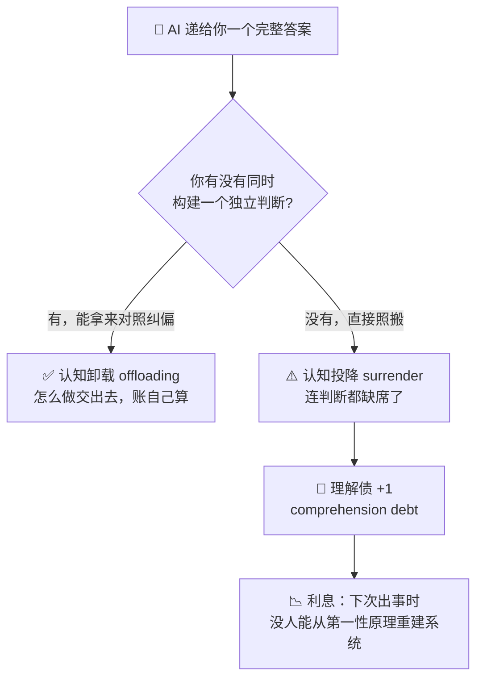
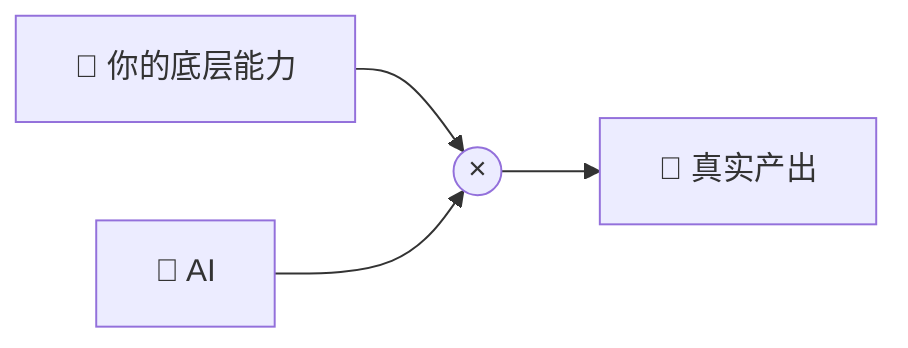

最近读到一个词，叫 **cognitive surrender**（认知投降），出自 Addy Osmani 的一篇博客 [Cognitive Surrender](https://addyosmani.com/blog/cognitive-surrender/)。读完有点后背发凉，因为里面描述的好几个场景，我自己几乎每天都在经历。

先抛一个画面：agent 给你生成了一个 600 行的 MR，你扫了一眼，变量名挺合理，测试也是绿的，于是点了 approve。中间有一处事务边界的微妙改动，你没看见。

这不叫 review，这叫"批准"。Addy 有句话很扎心——**the surrender was the absence of a decision**：所谓投降，就是一个本该做出的判断，缺席了。

这篇文章想顺着他的框架，把这条线讲清楚：它到底在哪、为什么工程师格外容易踩过去，以及怎么尽量待在安全的那一边。

## 🧠 先分清两个词：offloading 和 surrender

这篇文章最值得记住的，是一个区分。它来自 Wharton 的 Steven Shaw 和 Gideon Nave 的论文，Addy 把它讲得很清楚：

- **认知卸载（cognitive offloading）**：计算器、搜索引擎、GPS 都属于这一类。**把具体的活儿交给工具，但"要去哪""对不对"还握在自己手里**。比如用 GPS：是你决定去哪，它只负责算路线；万一它把你导进河里，你一眼就知道不对，会立刻自己接管。
- **认知投降（cognitive surrender）**：你干脆不再构建答案了。AI 的输出直接变成你的输出。没有什么需要你去推翻，因为你压根没形成一个能拿来对照的独立看法。

放在一起对比，差别会更直观：

| | 认知卸载 offloading | 认知投降 surrender |
|---|---|---|
| 交出去的 | 怎么做（how） | 连判断本身 |
| 自己保留的 | 结果对不对的判断 | 什么都没留 |
| 类比 | 用计算器算账 | 照抄别人的答案 |
| 出错时 | 能发现并纠偏 | 无从纠偏，因为没有自己的看法可对照 |

用一张图把这条线画出来，差别就在那个「你有没有自己的判断」的岔路口：

简单说，offloading 是"我让你帮我跑腿，但账我自己算"；surrender 是"账我也不算了，你说多少就是多少"。

麻烦的地方在于：这两件事从内部体验上，**长得一模一样**。都是"我用了 AI，然后事情办完了"。你很难在当下分辨自己刚才是卸载还是投降。

## 📊 数据：人有多容易投降

如果只是观点，倒还好说。可怕的是有数据。

Shaw 和 Nave 的三个实验、1372 名参与者里，Addy 转述了两个让人不太舒服的结论：

- 在 AI 给出**错误**答案的那些题上，参与者有 **73% 的概率直接接受了错误答案**。
- 更微妙的是，只要 AI 在场，人的**自信反而上升了**——哪怕有一半答案是故意设错的。

第二点是关键：人们借来了模型的自信（模型的语气总是很笃定），然后把它当成了自己的。这种"借来的自信"，正是投降从一个泛泛的认知话题，变成一个工程话题的拐点。

这样的信号不止一处，Addy 还举了两项研究。

一项来自 Anthropic：同样是学一个新库，**让 AI 直接把代码生成出来**的工程师，事后在理解测验上比对照组低了 **17%**；而**拿 AI 来做概念性探究**——追问原理、和它掰扯各种取舍——的人，成绩反而稳得住。同一个工具，**姿势变了，结果就两样**。另一项是 MIT 的《Your Brain on ChatGPT》，它甚至在神经层面看到了代价：越依赖 AI 的写作者，大脑神经连接越弱，对自己刚写下的内容记得越差，也越难把当初的推理过程重新讲一遍。

## 🔍 它在我们的工作里长什么样

Addy 列了几个场景，我读的时候基本是一边点头一边心虚。挑几个翻译成我们更熟悉的样子：

**读 diff 的时候。** agent 产出一个 MR，你扫一眼，命名合理、测试通过，approve。中间藏着一处边界条件下被悄悄翻转的默认值，你没去看。你不是 review 了代码，你是"追认"了它。

**调一个你没真正搞懂的报错。** 报错栈看着吓人，你贴给 agent，它给了个 fix，跑通了，你继续往前。两周后相关的症状又冒出来，你才发现自己当初根本没理解那个 bug，只是抹掉了它的表面表现。你脑子里那张系统地图，在某个你指不出来的地方，已经画错了。

**做一个设计决策。** 队列还是直连？你问 agent，它用一段听起来很有道理的话选了一个，你照做了。可你并没有真正想过自己的吞吐、失败模式、重放语义。你把模型对问题的"框定"和它给的"答案"，一口气全收下了。

这几件事的共同点是同一个：模型递过来一个完整的答案，而我们**没有同时在脑子里构建一个属于自己的平行版本**去对照。有时候这没问题，有时候这就是投降——而它们从内部看，真的一样。

## 💸 投降是怎么一点点变成债的

Addy 把这件事和他之前提的一个概念接上了：**comprehension debt**（理解债）——你系统里的代码量，和团队里真正有人理解的代码量，这两者之间的缺口。

他给了一个很准的因果：

> 认知投降，是你"欠下"认知债的动作；理解债，是这笔账单，以丢失的心智模型计价。利息会在下一次出事、而没人能从第一性原理重建系统时，一次性还清。

每一次投降都是一笔小额借款。代码库多了一块你没真懂的补丁，架构多了一个你没参与的决定，测试套件多了一条你想不到要写的用例。当天看都不疼，但它们会**复利累加**。

而且——这点要说清楚——**债不是 AI 造成的，是你面对它的姿势造成的**。同一个模型，可以掏空一个工程师的心智模型，也可以磨利另一个的，区别只在于：你是在用它思考，还是用它代替思考。

## ⚠️ 为什么工程师格外容易中招

Addy 专门讲了几条，说软件工程师比一般知识工作者更暴露在这个风险下。我觉得每一条都成立：

- **表面信号默认看着就对。** 生成的代码能编译、过 lint、能跑、风格和文件里其它部分一致。大多数领域没有这么强的"看起来很像样"的滤镜，我们有——而且它是个**错的**滤镜。表面正确不等于系统正确，投降恰好就藏在这道缝里。
- **被看见的指标是吞吐。** MR 合了多少、feature 发了多少、ticket 关了多少。这些数字分不清"我做的、我懂"和"agent 做的、我批的"。短期里组织对两者一视同仁，于是投降对仪表盘是隐形的。
- **自信会无损传递。** 模型用陈述句说话，code review 又习惯把陈述句读成权威。当 agent 写下"这里用 300ms 的 debounce 来防抖"，听起来像团队沉淀的知识，哪怕这个数字是它当场编的。你继承了它的笃定，却没继承它（根本不存在）的推理。
- **投降会自我繁殖。** 一旦你接受了一块没真懂的代码，下次再改它，几乎注定又是一次投降——因为要形成独立看法，你得先把上次跳过的部分补回来。投降是有路径依赖的。

## 🧭 怎么待在 offloading 这边

Shaw 本人其实挺克制，他不主张恐慌。Addy 引了他一句话，我觉得是整篇的题眼：

> 关键不是"AI 好不好"，而是**校准（calibration）**：知道什么时候 AI 在帮你思考，什么时候它在悄悄替你思考。

所以要常问自己一个问题：**我是在对这个答案形成独立判断，还是整套照搬了 agent 的看法？** 这是两种心理动作，但从外面看一模一样。

Addy 给了几个自检的小习惯，我挑几个最好上手的：

- **先写下预期，再看输出。** 跑 agent 之前，先在心里（或纸上）写下你觉得答案大概长什么样：三行还是五十行、队列还是直连、bug 在这个模块还是那个。对上了，说明你校准在线；对不上，你就有了一个真正的选择——是我错还是它错。这个选择，正是投降会跳过的那一步。
- **像 AI 没写过这段一样去 review。** 把它当成组里一个 junior 提交的 MR：你会因为"测试过了"就合吗？不会。作者换成模型，标准不该变。"看着没问题"从来不算 review。
- **让模型自己反驳自己。** 大多数模型会先给一个笃定的答案，你一让它唱反调，它又能给一个同样笃定的反方。这第二遍很便宜，却能打断"借来的自信"。如果你分不清两个答案哪个对，恭喜，你刚好找到了一个差点要投降的地方。
- **注意自己累不累。** 投降是个疲劳现象。当天第一个 MR 你会认真看，第五个就只是瞄一眼。"累到没法评估时，就别让 agent 继续生成了"——这点自知之明，现在也算工作的一部分。

## 🛠️ 把反投降写进流程

光靠个人自律不够，Addy 更看重结构性的办法——把"让投降变难"的脚手架搭进流程里。几个我觉得能落地的：

- **验证作为硬性退出条件。** 每个 agent 完成的任务，都要落在具体证据上：一个能跑的测试、一张截图、一段日志、一次 reviewer 签字。"看着像做完了"是对投降友好的退出，"这是它能 work 的证据"才是抗投降的退出。
- **更小的 scope，更小的 MR。** 投降会随体积放大：50 行你真能读，600 行你读不了。Google 那个 ~100 行 MR 的习惯，本是为人服务的，但它对抗 AI 投降同样有效。一句话——**审查的单元，就是理解的单元；把单元缩小到你真能理解为止。**
- **学新东西时，先问原理再让它写。** 这就是前面那个 17% 的结论换成习惯：面对新库、新系统，先让 agent **解释**，再让它**生成**。同一个工具，拿来盘问而不是拿来产出，是在筑高而不是掏空你的心智模型。
- **故意制造摩擦。** 生成前先写一页设计、合并前加一道确认、部署前过一遍 checklist。摩擦在效率叙事里名声不太好，但它恰恰是卸载和投降之间的那道墙。

## 🤝 结尾：是合作，不是外包

Addy 最后落在一个不那么丧的画面上。认知科学家 Andy Clark 区分了两件事：**把任务委托给（delegate to）** AI，和**与（cooperate with）** AI 协作。

委托产生投降；协作产生他说的**相互放大（mutual amplification）**：你的 prompt 磨利模型的输出，输出又磨利你的下一个 prompt，进而磨利你对问题的理解——一个会越转越亮的正循环：

两种姿势用的是同一套工具，都能产出能发布的代码。从外面看，在单个 sprint 里它们一模一样。差别会在半年后显形——某个东西崩了，其中一个工程师能从第一性原理修好，另一个不能。

回到开头那个 600 行 MR。问题从来不是"要不要用 agent"——我自己每天都在用，也确实比以前产出多。真正的问题是那句话：**你的代码在发布，你对系统的理解，是在增长，还是在萎缩？**

如果只记住三件事，我会留这三句：

1. **offloading 是超能力，surrender 是它没校准时的失败模式。** 工作越来越像是：随时知道自己站在那条线的哪一边。
2. **表面正确不是系统正确**，而工程师手里那个"看着像样"的滤镜，恰恰是最危险的。
3. **债不是 AI 欠的，是姿势欠的。** 工具一样，姿势不一样，半年后见分晓。

## 💡 写在最后：几句我自己的话

读完之外，我自己还想多补三点，算是这阵子用 AI 写代码攒下来的一点私货。

**一、AI 是能力的放大器，但放大不了一个不存在的能力。** 说白了就是一个乘法：

任何数乘以 AI 都会被放大，唯独 **0 乘多少还是 0**。所以它帮不了你做你**根本不理解**的事——即便它当场替你做了，那也不是能力，是一笔押后再还的风险。理解为零的地方，被放大的往往不是产出，而是隐患。

**二、做主动的冲浪者，别只满足于"会用 AI"，要学会"驾驭 AI"。** 会用，是把它当成一个更快的搜索框；驾驭，是知道它什么时候靠谱、什么时候在一本正经地胡说、为什么会这样。这就要求你对 AI 的**基本原理、运行机制、工具链**保持主动了解和持续学习——浪是借不来的，你得自己站上去。

**三、多思考，多问"为什么"，别只从结果倒推。** 看到一个能跑的结果就反推它一定对，是最省力、也最危险的姿势。AI 时代真正该练的，是**同时用好归纳和推演这两个思维工具**：既能从一堆现象里归纳出规律，也能从第一性原理一步步推演下去。这是让自己的脑子**不随 AI 一起退化、而是一起进化**的关键。

## 📚 参考资料

- Addy Osmani, [Cognitive Surrender](https://addyosmani.com/blog/cognitive-surrender/)（本文解读对象，文中数据、研究与启发式均出自此文）
