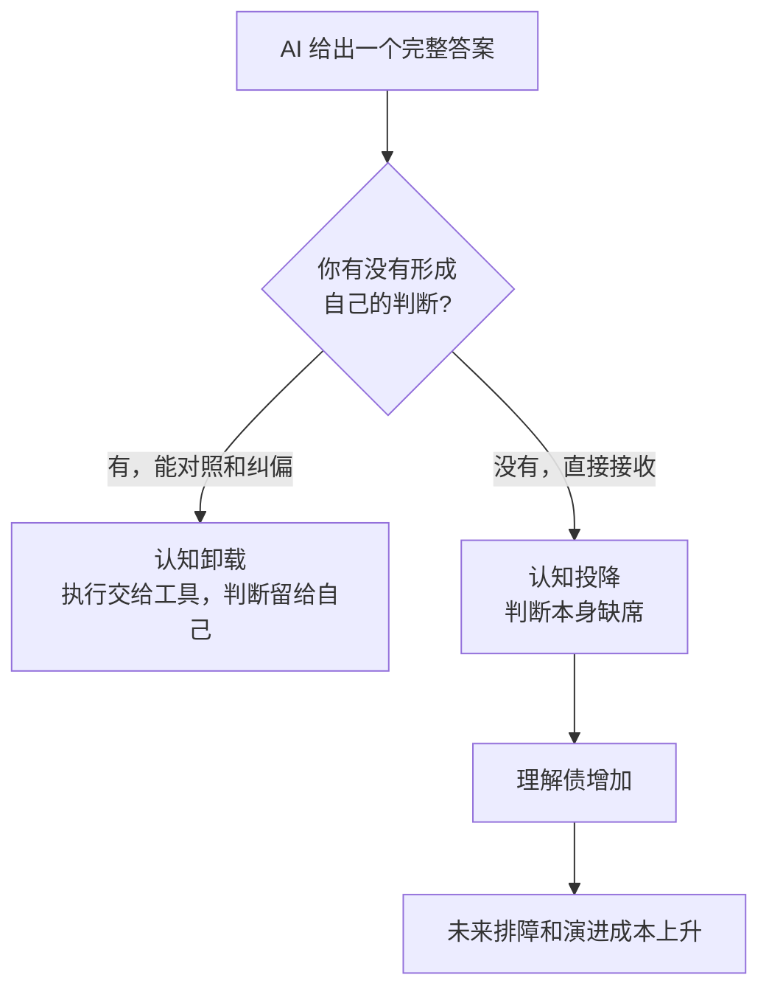
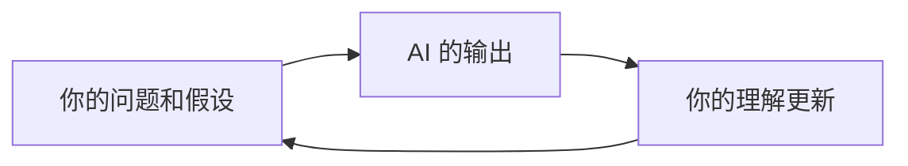
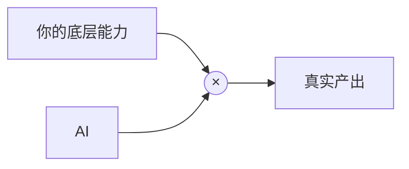

最近读到 Addy Osmani 的两篇文章：[Cognitive Surrender](https://addyosmani.com/blog/cognitive-surrender/) 和 [Don't Outsource the Learning](https://addyosmani.com/blog/dont-outsource-learning/)。

前一篇讲的是 cognitive surrender，可以翻译成"认知投降"：当 AI 给出一个答案时，人不再形成自己的判断，而是直接接收它。后一篇把这个问题继续往前推了一步：AI 不只可能替我们判断，也可能让我们跳过本该要进行的学习过程。

这两篇文章放在一起，讲的是同一件事的两面：

> AI 可以帮我们工作，但判断和学习要留在自己手里。

先从一个很常见的场景说起。

agent 生成了一个 600 行的 MR。变量名看起来合理，测试是绿的，改动也符合需求描述。你扫了一遍，点了 approve。中间有一处事务边界的微妙变化，你没仔细看。

从流程上看，这叫 review；但从认知动作上看，它其实是"批准"。Addy 在文里有一句话说得很准确：

> the surrender was the absence of a decision

所谓投降，不是你做了一个错误决定，而是一个本该由你做出的判断缺席了。

这篇文章想顺着这个问题梳理三件事：认知卸载和认知投降的边界在哪里；为什么 AI 写代码时工程师更容易跨过这条线；以及我们能用什么工作习惯，把 AI 变成"帮我思考"而不是"替我思考"。

## 先画一条线：offloading 和 surrender

Addy 在《Cognitive Surrender》里借用了 Wharton 研究者 Steven Shaw 和 Gideon Nave 的区分：**cognitive offloading** 和 **cognitive surrender**。

这两个词看起来接近，但差别很关键。

| | 认知卸载 offloading | 认知投降 surrender |
|---|---|---|
| 交出去的是什么 | 具体执行、计算、搜索、生成 | 判断本身 |
| 自己保留什么 | 目标、校验和纠偏 | 很少形成独立判断 |
| 常见类比 | 用计算器算账 | 照抄别人的答案 |
| 出错时 | 能发现并接管 | 不容易发现，因为没有自己的版本可对照 |

用 GPS 举例会比较直观。

你开车时让 GPS 算路线，这是认知卸载。目的地是你定的，路线是否合理你也大致能判断。它如果把你导到一条明显不对的路上，你会接管。

但如果你完全不知道自己要去哪里，也不关心路线是否合理，只是它说左转你就左转，这就接近认知投降了。工具不再只是帮你算，而是在替你决定。

同样的判断，搬到 AI 编程里大概是这样：

所以，问题不是"用不用 AI"。真正的问题是：AI 给出答案时，你有没有一个自己的版本可以拿来对照。

这也是最容易被忽略的地方。认知卸载和认知投降从外部看很像：都是用了 AI，任务也都完成了。差别不在产出表面，而在你的脑子里有没有同时完成一次认真的思考和判断。

## 研究信号：姿势比工具更重要

如果这只是一个写作者的观察，参考价值有限。Addy 在两篇文章里串起了几组研究，它们的方向比较一致：AI 本身不是问题，使用姿势才是关键变量。

Shaw 和 Nave 的三个实验里，一共有 1372 名参与者。Addy 转述了两个很值得留意的结果：

- 在 AI 给出错误答案的题目上，参与者有 73% 的概率接受了错误答案。
- 只要 AI 在场，人的自信反而会上升，即使其中有一半答案是故意设错的。

第二点尤其值得工程师注意。模型经常用非常肯定的语气说话，而我们在 code review、方案讨论里又习惯把肯定语气读成专业判断。于是，人很容易借来模型的自信，却没有同步获得它背后的推理。

不只是判断在"投降"，学习机会也可能一起溜走。《Don't Outsource the Learning》里提到了一项 Anthropic 的实验：工程师学习一个新的 Python 库时，有 AI 辅助和没有 AI 辅助的两组完成任务速度差不多，但后续理解测验里，AI 组明显更低，大约是 50% vs 67%。

更有意思的是 AI 组内部的差异：把 AI 用来问概念、追问原理的人，理解分数能到 65%+；直接复制生成代码的人，则低于 40%。

这组结果很适合贴在显示器旁边：

> 同一个工具，可以帮你学习，也可以帮你绕过学习。

MIT 的《Your Brain on ChatGPT》也给了类似提醒。Addy 转述说，LLM 组里有 83% 的人，写完后无法准确引用自己刚写下的一句话。还有一项 CHI 2026 研究指出，如果任务一开始就让 LLM 介入，它会先替人框定问题；即使后续由人继续完成，初始锚定也会影响后面的决策质量。

简单说，AI 不只是给答案。它还会影响你从哪里开始想、沿着哪条路径想，以及要不要继续想。

## 工程里最常见的三种投降

把这些研究放回软件工程，认知投降通常不是以一个很大的错误出现，而是藏在很多很普通的工作动作里。

### 读 diff 时的投降

agent 产出一个 MR，命名合理、测试通过、风格也和项目一致。你快速扫过，觉得没什么问题，就合了。

这里的问题不在于 AI 写代码，而在于你可能只检查了"它像不像正确答案"，却没有检查"它是不是系统里的正确改动"。比如默认值被改了、事务边界变了、错误重试语义变了，这些都不一定会在表面信号里暴露出来。

### debug 时的投降

你遇到一个复杂报错，把 stack trace 贴给模型。它给了一个 fix，跑通了。于是你继续下一个任务。

这在交付上完全合理。但如果你没有顺手问清楚"为什么这个 fix 有效"、"根因是什么"、"还有没有同类问题"，那这次 debug 只修掉了症状，没有补上心智模型。

### 设计决策里的投降

要不要引入队列？缓存放本地还是远端？这个 API 要不要做幂等？你问 AI，它给出一个听起来很完整的答案。你采纳了。

这里最容易被外包出去的，不是具体代码，而是问题的框定方式。模型替你决定了哪些变量重要、哪些风险可以忽略、应该从哪个角度做取舍。如果你没有把这些前提重新拿回来检查，后面的答案再漂亮，也可能是在一个不适合你的问题框架里推出来的。

这三种场景的共同点是：模型递过来一个完整答案，而我们没有形成一个自己的平行版本。

## 理解债：任务关掉了，能力不一定增长

Addy 还把认知投降和另一个概念连在一起：**comprehension debt**，理解债。

它指的是：代码库里存在的逻辑，和团队真正理解的逻辑之间的缺口。

这个概念很适合解释 AI 编程里的微妙问题。每一次认知投降，都可能让系统多出一块"能跑但没人真懂"的区域。当天看起来只是一个小补丁，长期累积起来，就会变成后续维护、排障和演进里的成本。

《Don't Outsource the Learning》把同一件事讲得更日常：bug 修好了，但你的 mental model 没有前进；issue 关掉了，但你下次独立处理同类问题的能力没有变强。

我们现在很容易进入一个默认循环：

1. 遇到需求或报错。
2. 贴给模型。
3. 模型给出修复。
4. 症状消失。
5. 继续下一个任务。

从吞吐角度看，这条链路很顺。但从学习角度看，中间最重要的部分被压缩了：你没有形成假设，没有走过错误路径，也没有被迫把系统的因果关系重新梳理一遍。

当然，不是所有东西都值得认真学习。一次性脚本、样板代码、低风险的胶水代码，该交给工具就交给工具。真正需要谨慎的是那些会进入长期系统、影响架构判断、决定未来排障能力的部分。

这些地方如果只拿 AI 关任务，不拿 AI 建立自己的理解，短期速度就很容易慢慢导致长期能力缺口。

## 为什么工程师尤其容易跨过这条线

软件工程师不是唯一会遇到认知投降的人，但我们确实更容易遇到它。有几个原因值得单独拿出来说。

代码有很多"看起来正确"的表面信号，它能编译、过 lint、测试是绿的、命名也像项目里的代码。这些信号很有用，但它们并不等价于系统正确。

组织指标更容易看见吞吐，而不是理解。MR 合了多少、需求关了多少、迭代快不快，这些都很好统计。但"这段代码团队里有几个人能从第一性原理解释清楚"，通常不会出现在业务数据上。

AI 的自信很容易传递，模型用肯定句输出，文档式语言也很完整。它说"这里用 300ms debounce"，听起来像一个经过验证的工程经验，但这个数字可能只是它上下文里最顺手的选择。

理解缺口会形成路径依赖。一旦你接受了一块没真懂的代码，下次再改它，就更容易继续依赖 AI。因为要形成独立判断，你得先把上次跳过的部分补回来。这个债不会自动消失，只会越滚越大。

所以，AI 编程真正考验的不是"会不会 prompt"，而是你有没有一套校准机制：什么时候可以放心卸载，什么时候必须让自己来进行关键判断。

## 什么时候应该自己来做关键判断

Addy 引用了 Shaw 的一个判断：关键不是"AI 好不好"，而是 **calibration**，也就是校准。你要知道什么时候 AI 在帮你思考，什么时候它在替你完成本该由你做的判断。

我理解最简单的自检问题是这一句：

> 我是在对这个答案形成独立判断，还是整套接收了 agent 的看法？

具体到工作里，可以拆成几个习惯。

### 先写下预期，再看输出

跑 agent 之前，先用两三句话写下自己的判断：问题可能在哪里、改动大概会落在哪几个文件、方案可能长什么样。等模型输出后，再拿它来对照。

对上了，说明你的心智模型和工具输出大体一致；对不上，就不要急着接受，先判断是你漏了信息，还是模型走偏了。

### 先问解释，再要代码

遇到新库、新框架、新系统时，第一轮不要直接说"帮我实现"，而是先问：它的工作机制是什么？有哪些方案？各自 tradeoff 是什么？什么时候不应该用它？

等你能复述基本机制，再让 AI 写代码。这样 AI 更像一个陪你梳理问题的同事，而不是一个把作业写完的外包。

### 像审同事代码一样审 AI 代码

不要因为作者是模型，就降低 review 标准。测试通过只是起点，还要看边界条件、失败路径、数据一致性、兼容性、可观测性，以及这段代码是否符合系统原本的设计方向。

### 让模型自己反驳自己

让它列出这个方案可能错在哪里、有哪些替代方案、什么情况下不应该这样做。这一步很便宜，但能有效打断"借来的自信"。

如果反方理由你完全判断不了，那恰好说明这里需要补充理解，而不是继续让 AI 往下推进了。

### 偶尔手动重写一遍

找一段模型刚写好的关键代码，关掉补全，自己从头写一遍。写不出来的地方，就是刚才被跳过的学习点。

这不需要每次都做，但它像一次体检，能告诉你自己到底是在变强，还是只是越来越会把任务交出去。

## 制定对抗流程

只靠个人自律不太稳定，最好把一些反投降的动作写进团队流程里。

### 验证要作为退出条件

每个 agent 完成的任务，都要落在具体证据上：一个能跑的测试、一张截图、一段日志、一次 reviewer 确认。"看起来做完了"不够，"有证据说明它能工作"才更适合作为结束点。

### 控制 MR 和任务粒度

认知投降会随着体积放大。50 行你可能真能读，600 行就很容易只看表面。审查的单元，最好就是你能理解的单元。

### 把学习也作为 session 的指标

Addy 提到自己会在 coding session 结束时问一句：今天我是学到了什么，还是只是关掉了几个 issue？

这个问题很朴素，但很有用。团队通常会自然地看吞吐，但工程师自己的长期资产，往往藏在第二个问题里。

### 给重要决策保留一点摩擦

比如生成前先写简短设计，合并前过 checklist，部署前看一次风险清单。摩擦不一定都是坏事。有些摩擦，是为了让判断重新出现。

## 小结一下

Addy 最后落到一个更积极的方向。认知科学家 Andy Clark 区分了两件事：**把任务委托给（delegate to）** AI，和**与（cooperate with）** AI 协作。

委托很容易走向投降。协作则更像一个循环：你的 prompt 改善模型输出，模型输出又帮助你看见问题的新角度，进而改进你的下一轮判断。

这才是我更愿意接受的 AI 编程方式：不是把脑子交出去，而是让工具参与到自己的思考回路里。

回到开头那个 600 行 MR。问题从来不是"要不要用 agent"。我自己也每天在用，而且它确实提高了很多工作效率。真正的问题是：

> 代码在发布的同时，我对系统的理解是在增长，还是只是在把任务往前推？

如果只记住几句话，我会留这四句：

1. offloading 是能力放大，surrender 是判断缺席。
2. 表面正确不是系统正确，测试绿了也不等于你理解了。
3. 不要只外包任务，也顺手外包了学习。
4. 债不是 AI 欠的，是使用姿势欠的。

## 写在最后

读完 Addy 这两篇文章，我自己还想补三点，算是这段时间用 AI 写代码的一点经验。

### AI 是能力放大器，但放大不了不存在的能力

可以粗略理解成一个乘法：

AI 能放大已有能力，也能帮你更快摸到新领域的边界。但如果一个问题你完全没有理解，它当场替你做完，也不等于这项能力已经长出来。

### 别只满足于"会用 AI"，要学会校准 AI

会用，是把它当成一个更快的搜索框或代码生成器。校准，是知道它什么时候靠谱、什么时候需要质疑、什么时候应该停下来补上下文。

这要求我们对 AI 的基本原理、工具链和常见失败模式保持一点持续学习。不是为了变成模型专家，而是为了更清楚地知道工具边界在哪里。

### 多问为什么，别只从结果倒推

看到一个能跑的结果，就反推它一定对，这是很省力但也容易误判的姿势。AI 时代更应该练的，是同时用好归纳和推演：既能从现象里归纳规律，也能从第一性原理一步步推回系统设计。

说到底，AI 最好的位置不是替我们省掉思考，而是让思考的反馈更快、材料更多、迭代更密。工具越强，越需要人把方向盘握稳一点。

AI 时代，我们更应该求拙，Slow is fast。

## 参考资料

- Addy Osmani, [Cognitive Surrender](https://addyosmani.com/blog/cognitive-surrender/)（本文主要解读对象之一）
- Addy Osmani, [Don't Outsource the Learning](https://addyosmani.com/blog/dont-outsource-learning/)（关于 AI 使用姿势、学习方式与 cognitive debt 的延伸讨论）
