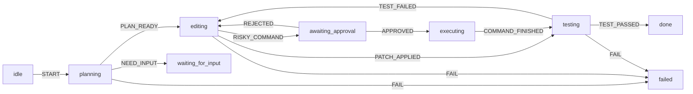

一个提交按钮最容易写成这样：


```ts
const [loading, setLoading] = useState(false)
const [success, setSuccess] = useState(false)
const [error, setError] = useState<string | null>(null)
```


代码没有错，只是留下了几种尴尬的组合：`loading` 和 `success` 能不能同时为 `true`？请求失败后再次提交，旧的 `error` 要不要清掉？页面刚打开时又算哪种状态？


状态机先把“哪些组合不该出现”定下来，再处理变量怎么存。状态和允许的变化写在一处，事件处理器就不用反复猜自己正处在哪个阶段。


AI Agent 把这个问题放大了。模型可以判断该读哪些文件、如何修一段代码；测试没过能不能结束、危险命令能不能执行、审批被拒绝后如何处理，却不能只听模型一面之词。


我们不依赖 XState 或其他库，先手搓一个最小状态机，再把它放进一个代码 Agent 的运行过程。


## 先把问题缩小：状态机到底是什么


一个平铺的有限状态机，通常有这几样东西：


- 一组有限的状态。
- 一组有限的事件。
- 一个初始状态。
- 一张迁移表：当前状态遇到某个事件后，能走到哪里。
- 可选的终止状态。


W3C 的 [SCXML 规范](https://www.w3.org/TR/scxml/)也用状态、事件和迁移描述这套模型：机器处于一个活动状态，收到事件后检查该状态声明的迁移，找到匹配项才走向目标状态。


把它收成一个式子：


```text
NextState = transition(CurrentState, Event)
```


`transition` 是一份许可清单。没有写进表里的边，程序就不该走。


### 用灯泡先看一眼


灯泡只有三种状态：


```ts
type LightState = 'unlit' | 'lit' | 'broken'
type LightEvent = 'TOGGLE' | 'BREAK'
```


点一下开关，未点亮会变成已点亮；再点一下会回去。灯泡坏掉以后，继续按开关没有意义。把这些规则放进一张表：


```ts
const lightMachine = {
  initial: 'unlit',
  states: {
    unlit: {
      on: { TOGGLE: 'lit', BREAK: 'broken' },
    },
    lit: {
      on: { TOGGLE: 'unlit', BREAK: 'broken' },
    },
    broken: {
      on: {},
    },
  },
} as const
```


“坏掉的灯泡不能再被点亮”现在写进了模型。`broken` 没有 `TOGGLE` 这条边，调用方就无法从它走到 `lit`。


这里只讲平铺的有限状态机。嵌套、并行和历史状态属于 statechart 的能力，真实产品会用到，先把这张最小迁移表看明白更重要。


## 最小实现：迁移函数比想象中短


配置有了，核心实现就是一次查表：


```ts
type Machine = {
  initial: string
  states: Record<string, { on?: Record<string, string> }>
}

function transition(machine: Machine, state: string, event: string) {
  const next = machine.states[state]?.on?.[event]

  if (!next) {
    return { value: state, changed: false }
  }

  return { value: next, changed: next !== state }
}

transition(lightMachine, 'unlit', 'TOGGLE')
// { value: 'lit', changed: true }

transition(lightMachine, 'broken', 'TOGGLE')
// { value: 'broken', changed: false }
```


这里让非法事件保持原状态，适合可以忽略重复点击的 UI。协议或资金流程往往要抛错：收到未声明事件，说明调用方已经违反约定。


状态机的骨架到这里就够了。它不发送请求，也不修改 DOM；相同的状态和事件总会得到相同结果，因此很好测试：


```ts
expect(transition(lightMachine, 'lit', 'BREAK')).toEqual({
  value: 'broken',
  changed: true,
})
```


它现在只负责判断下一步是否合法。


## 真实业务多出来的两层


灯泡模型够简单，业务通常没这么客气。提交表单时，除了 `idle`、`submitting`、`success`、`failed`，还要保存输入内容、接口结果和错误原因；迁移时还会触发网络请求、埋点和提示消息。


这些内容一股脑塞进 `transition`，很快就会变成长函数。拆成状态、数据和副作用三层，代码会清爽得多。


### Context 是状态旁边的数据


状态记录流程走到哪，`context` 保存这一步带着的数据。


```ts
type SubmitState = 'editing' | 'submitting' | 'success' | 'failed'

type SubmitContext = {
  form: { email: string }
  error?: string
}

type Snapshot = {
  value: SubmitState
  context: SubmitContext
}
```


接口响应和错误信息放在 `context`，不要硬塞进状态名。否则很快会出现 `failedWithNetworkErrorAndRetryable` 这种看一眼就累的名字。


### 副作用应该跟着迁移走，但别塞进迁移函数


网络请求、文件写入、发邮件、调用工具都属于副作用。它们会发生在某次迁移之后，但不该混进迁移函数。


一个常见做法是让迁移结果带上“接下来要做什么”的描述，再由运行时执行：


```ts
type Result = {
  value: string
  effects: Array<{ type: 'REQUEST' | 'SHOW_ERROR' }>
}

function runEffects(effects: Result['effects']) {
  for (const effect of effects) {
    if (effect.type === 'REQUEST') {
      // 由运行时发请求，再把成功或失败作为新事件送回机器
    }
  }
}
```


状态机给出下一步的计划，运行时把计划变成现实。前者好测，后者也便于替换和记录。


## AI Agent 里的状态机


表单的事件大多来自点击和接口回调。Agent 的事件更多：用户补充要求、模型提出工具调用、工具执行结果、测试结果、策略拦截、人工审批，都会改变一次运行的去向。


LLM 的输出不确定，本来就是它的工作方式。麻烦在于它拿到副作用权限之后：测试失败能不能直接宣布完成？遇到高风险命令能不能跳过审批？人拒绝后还能不能沿用之前的调用？


这时，状态机更像 Agent 外面的一层护栏。模型在 `editing` 里分析日志、提出修复方案；代码则维护“测试通过才能完成”这类迁移规则。高风险动作由工具和策略送进审批状态，不能直接执行。


别把模型的每一句推理拆成状态。状态机只管那些会改变运行权限、触发外部副作用或需要交接责任的节点。


### 一个代码 Agent 的最小流程


代码修改的分支不少，用 Mermaid 画出来更清楚。重点是看清 `editing` 和 `done` 中间少不了哪些门。





图里有三条值得写进程序的规则：


1. `testing` 收到 `TEST_PASSED` 后才能到 `done`。模型可以解释测试输出，不能跳过这条边。
2. 高风险命令先进入 `awaiting_approval`。批准、拒绝和恢复都是运行状态的一部分。
3. `failed` 是明确的状态，不只是日志里的一段报错。于是界面知道该展示什么，运行时也知道哪里允许重试。


LangGraph 的 Graph API 用状态、节点和条件边组织这类工作流，并提供持久化与 checkpoint；OpenAI Agents SDK 则允许工具调用暂停，等待人工审核后从原来的运行状态恢复。API 不同，做的却是同一件事：把流程边界留给显式规则。


### 审批不是一个弹窗，而是一次状态迁移


把“是否允许执行”写成 `if (confirm())`，在一个短脚本里已经够用。但对会暂停数分钟甚至数天的 Agent，这个模型不够了：审批期间进程可能重启，用户可能拒绝，也可能要求修改参数后再审批。


把审批建成 `awaiting_approval` 状态，生命周期才完整：


```text
editing
  + RISKY_COMMAND
  → awaiting_approval
  + APPROVED
  → executing
  + REJECTED
  → editing
```


状态可以被持久化。恢复时不用把它当成一项新任务，只需从原来的快照继续。审批、重试和可观测性因此有了共同的落点。


## 什么时候值得引入，什么时候别硬上


状态机不是所有 `useState` 的替代品。纯粹的开关、输入框文本、一次无分支的请求，都不值得先画图再写代码。


出现下面这些信号时，状态机通常开始划算：


- 某些状态组合“不可能”，却总要靠 `if` 防守。
- 一个动作是否可用取决于当前阶段，例如审批、支付、多步表单、播放器。
- 成功、失败、重试、取消之间有明确路径。
- 流程会暂停并恢复，需要保存中间位置。
- 多个角色或系统要在同一个流程里接棒。


反过来，如果只有一两个状态、迁移规则一眼能看完，直接写局部状态更省心。状态机的成本在于先建模。把一个简单按钮画成机场调度图，只是把复杂度从代码搬到图上。


## 写到最后


有限状态机是一种约束变化的方式：


- 状态描述流程现在站在哪。
- 事件描述发生了什么。
- 迁移表描述下一步是否被允许。
- `context` 承载流程附带的数据。
- 副作用由运行时执行，再把结果送回状态机。


放到 AI Agent 里，模型仍然负责探索和生成，状态机则把流程门口守住：测试没过就回去修，危险动作先暂停，审批被拒绝就回到可处理的状态。


模型负责在状态里探索，代码负责在状态之间把关。


## 参考资料


- [W3C SCXML](https://www.w3.org/TR/scxml/) —— 状态、事件、迁移与终止状态的通用状态机规范。
- [LangGraph Graph API](https://docs.langchain.com/oss/python/langgraph/graph-api) —— 用状态、节点与边构建持久化 Agent 工作流。
- [LangGraph Persistence](https://docs.langchain.com/oss/python/langgraph/persistence) —— checkpoint 与运行状态恢复。
- [OpenAI Agents SDK：Guardrails and human review](https://developers.openai.com/api/docs/guides/agents/guardrails-approvals) —— 工具审批的暂停、批准或拒绝，以及从运行状态恢复的流程。
