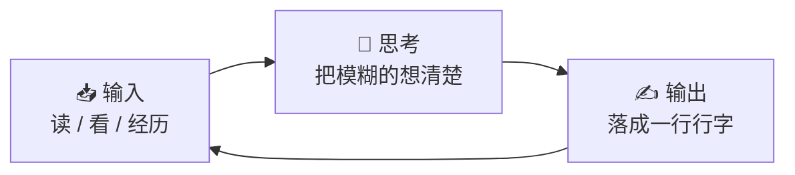

`Hello, World` 大概是每个写代码的人敲下的第一行程序。它什么也没做，只是朝世界挥了挥手，宣告一句「我开始了」。

这篇文章，就是这个博客的 `Hello, World`。

## 🤔 为什么又想写博客

道理我都懂，但还是想自己再走一遍。

工作久了会慢慢发现一件事：很多东西「我以为我懂了」，可真要讲给别人听、或者老老实实落成文字时，才发现中间有一大段其实是糊的。

写作是一种很诚实的自我检查。把模糊的想法摊开成一行行字，哪里没想清楚，自己其实骗不过自己。

所以对我来说，写博客倒不是为了输出多正确的结论，更多是这么几件朴素的事：

- 记录工作里的技术实践，和踩过的坑
- 沉淀一些值得过段时间再翻回来看的思考
- 用「输出」反过来逼自己认真「输入」

说白了，写给此刻的自己理清楚，也写给未来的自己当个备份。对我来说，写作差不多是这样一个会自己转起来的小循环：

## 🧭 这里大概会写些什么

我是一名前端工程师，日常在跨端开发和用 AI 提效之间来回打转，所以内容大概会绕着这几条线：

- **工程**：跨端、前端、AI Coding 的实践与复盘
- **阅读与思考**：把看过的、想过的，整理成自己能用的框架
- **一点生活**：观察、实验，以及偶尔的胡思乱想

不会很高产，但希望每一篇，都能把一件事讲清楚。

## 🚀 接下来

如果你也在路上，欢迎一起聊聊，可以在 [关于](/about) 页面找到我。

> 慢就是快，少就是多。

先这样。世界，你好。 :)
