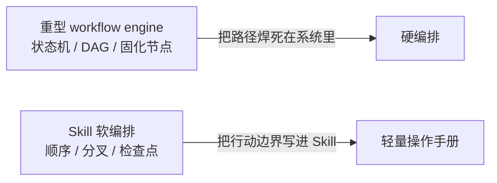
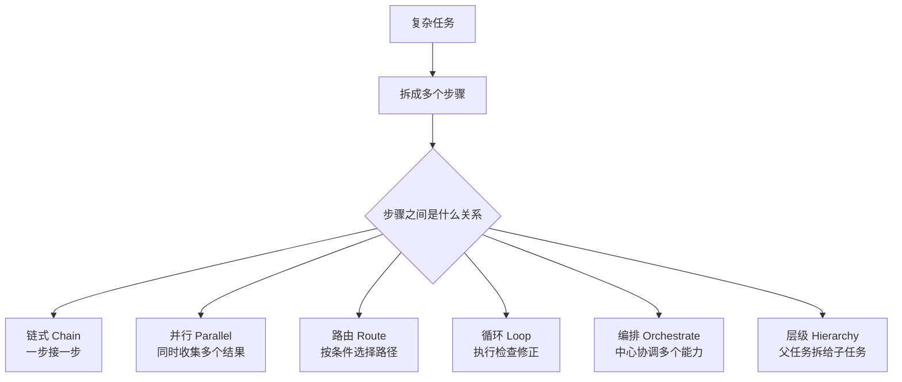
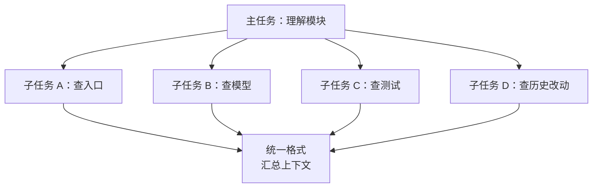
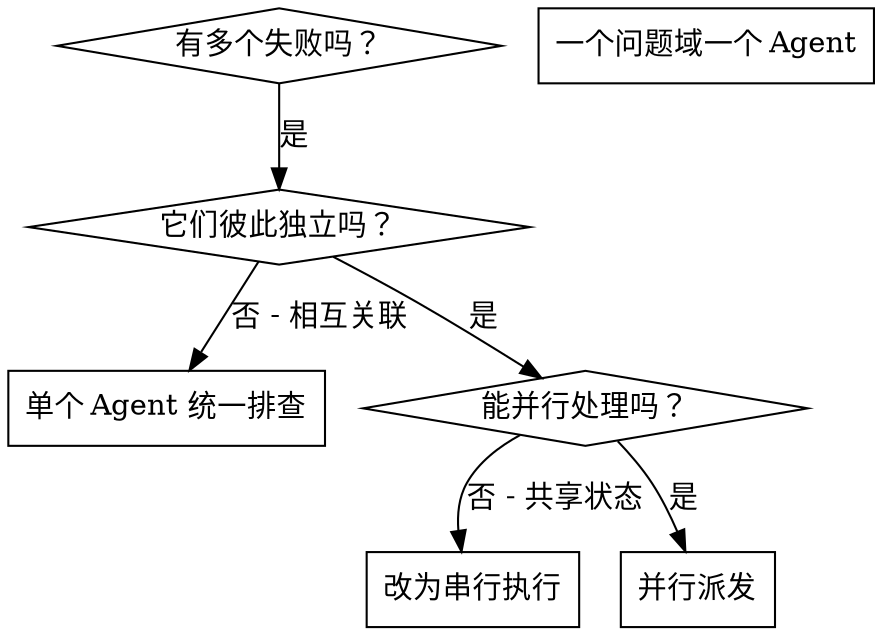
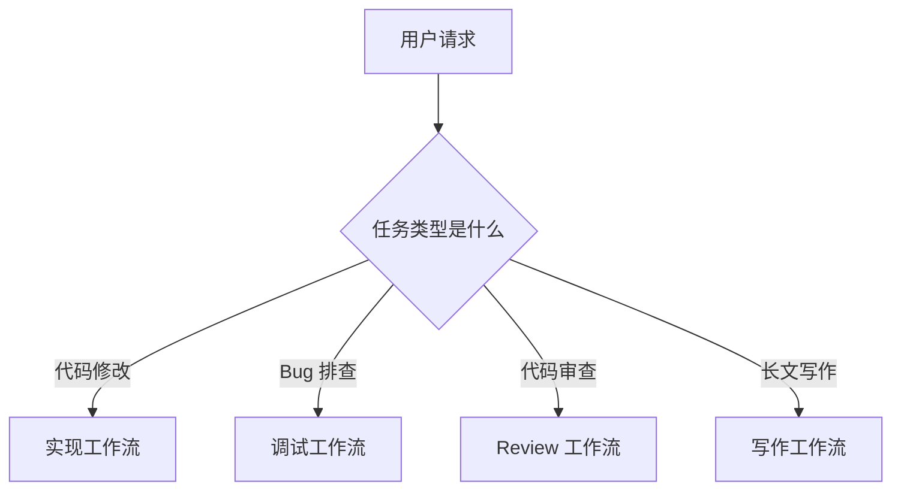
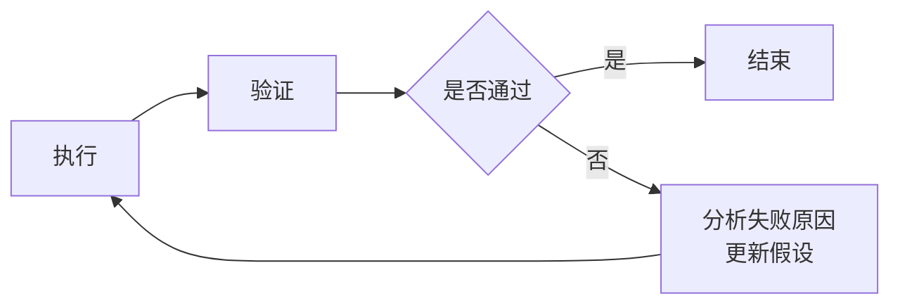
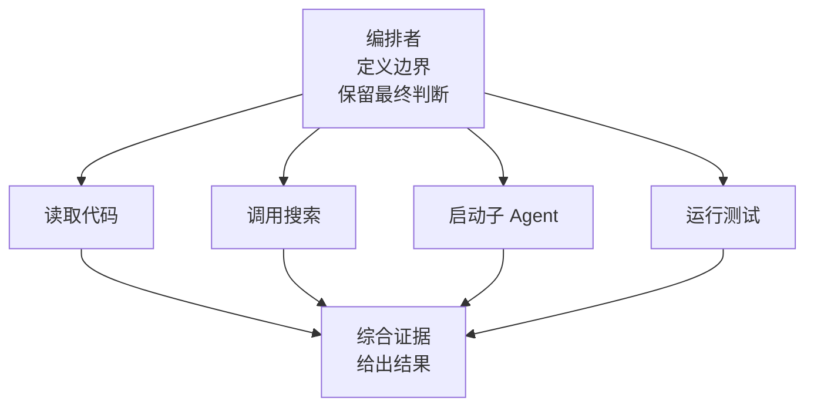
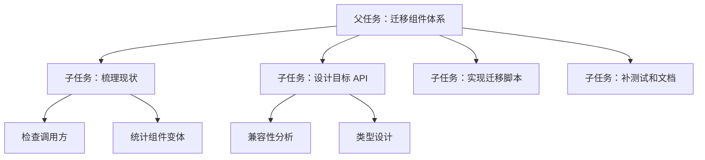
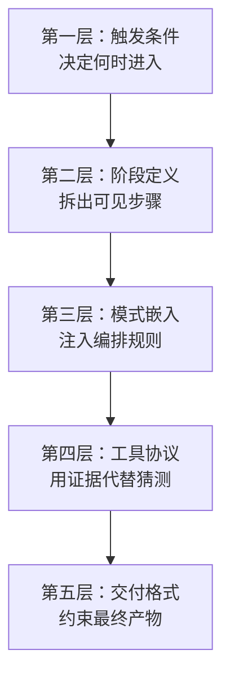
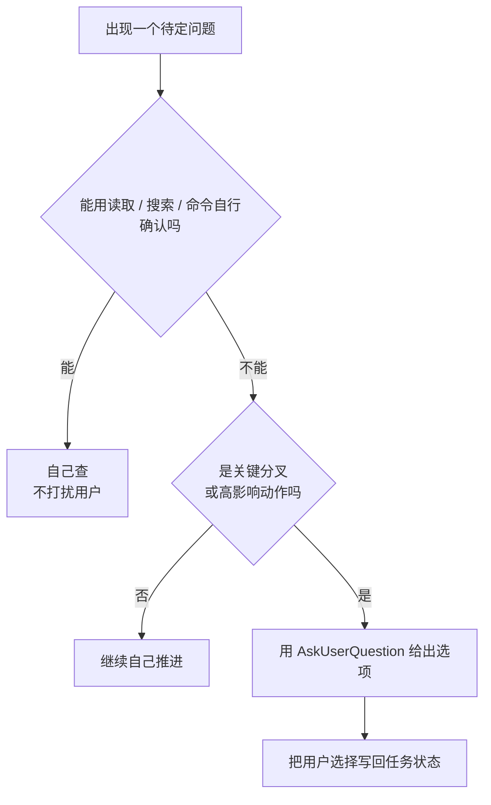

提到 Agent 工作流，大家可能会先想到一些很硬的东西：状态机、DAG、workflow engine、可视化节点编排，最好还能拖拖拽拽，像在控制室里调度一整排闪着灯的机器。


这些当然很重要。但在很多日常 AI Coding 场景里，我们其实并不一定需要一套重型编排系统。更多时候，我们需要的是一种更轻的东西：把任务拆开，把顺序讲清楚，把分叉条件写明白，把什么时候该停下来校验说清楚。像给一位很聪明、但偶尔会走神的同事留一张路线图。


这就是我理解的 **Skill 中的软编排**。


所谓“软”，不是说它随便，也不是靠玄学提示词祈祷模型听话。它更像一份写给 Agent 的工程操作手册：不直接把每一步固化成代码节点，但会把工作流的结构、约束、检查点和退出条件写进 Skill。这样模型在执行时不是在旷野里乱跑，而是沿着一条相对稳定的轨道前进。





一边是重型 workflow 引擎那样的“硬编排”，把每一步都焊死成节点；另一边是软编排，更像递给 Agent 一份写清楚的操作手册。


如果用一个很朴素的公式概括，大概是这样：


```text
Skill = 指令 + 编排模式 + 工具协议 + 验证门禁
```


这篇文章想聊三件事：


- 常见的几类编排模式：链式、并行、路由、循环、编排、层级。
- 这些模式在 Skill 里可以怎么表达。
- 当执行者本身是概率模型时，我们如何尽量保障结果的确定性。


## 先理解什么是编排

编排的核心不是“把节点画得很好看”，而是回答一个更基础的问题：


> 一个复杂任务，应该按什么顺序、以什么边界、由谁来完成？


如果任务足够简单，比如“把这个变量改个名字”，不需要编排。直接做就行。


但任务一复杂，岔路自然就冒出来了。比如写一篇技术方案，需要先理解背景，再查代码，再比较方案，再写文档，再做验证。这里面有顺序，有分支，有重复，也有不同角色之间的协作。


编排就是给这些动作建立结构。


我们可以先用一张图看整体关系：





这些模式并不是互斥的。真实工作流里，它们经常混在一起，像几根不同颜色的线拧在同一股绳里。比如一个父 Agent 先路由任务类型，然后并行启动几个子任务，最后进入一个检查循环。


听起来有点像项目管理，只是项目经理变成了一段 Skill。仔细想想，这个比喻还挺诚实：它管不了所有细节，但能让一群动作不要互相踩脚。


## 六种常见编排模式

### Chain：链式

链式是最直观的模式：上一步的输出，是下一步的输入。


链式适合那些天然有先后依赖的任务。比如修 bug 时，通常不能一上来就改代码。更稳的顺序是：先复现，再定位，再修改，再验证。跳过定位直接改，多半只会越改越乱，原始问题还在。


在 Skill 里，链式通常写成明确的阶段：


```markdown
## 工作流

1. 理解用户需求
2. 检查相关文件
3. 提出范围最小且安全的修改方案
4. 执行修改
5. 运行聚焦验证
6. 总结结果
```


这里的关键不是编号本身，而是每一步的输入输出要清楚。


比如“检查相关文件”的输出应该是“知道要改哪里，以及为什么”；如果这一步没有完成，就不能跳到“执行修改”。否则就像没看地图就开始修桥，手很快，方向不一定对。


[`executing-plans`](https://github.com/obra/superpowers/blob/main/skills/executing-plans/SKILL.md) 这个 Skill 是很直观的例子。它的流程基本就是一条链：先读取计划，再批判性审阅，接着逐个执行任务，每个任务都要标记状态、按步骤执行、运行验证，最后再进入收尾 Skill。


没有读完计划，就不能开始执行；验证没过，就不能把任务标成完成；所有任务没完成，就不能进入最终收尾。这就是链式最朴素的价值：不是给每一步编号，而是让每一步都能检验自己的前提。


### Parallel：并行

并行模式适合多个子任务之间没有强依赖，可以同时做。


比如做一次代码理解，可以同时让不同 Agent 查这些问题：


- API 入口在哪里？
- 数据模型在哪里？
- 测试覆盖在哪里？
- 最近相关改动是什么？


它们之间不需要互相等待，最后再汇总结果。





在 Skill 里，并行通常不是靠一句“请并行执行”就结束了，而是要补充两个约束：


| 约束 | 作用 |
|---|---|
| 每个并行分支的边界 | 避免多个 Agent 重复查同一件事 |
| 汇总格式 | 避免最后拿到四份风格完全不同的报告 |


一个更实用的写法是：


```markdown
当探索任务可以并行时，为下面几个方向分别启动子 Agent：

- API 入口和对外能力
- 数据模型和持久化逻辑
- 测试覆盖和验证命令
- 潜在风险和边界场景

每个子 Agent 必须返回：

- 已检查的文件
- 关键发现
- 不确定点或缺失证据
- 建议的下一步
```


并行跑得快，但容易各说各话。Skill 里的重点，就是把结果收回来：每个分支各查各的，但都按同一种格式把证据交回来。像几个人分头去不同书架找资料，最后还是要回到同一张桌子上摊开。子是 [`dispatching-parallel-agents`](https://github.com/obra/superpowers/blob/main/skills/dispatching-parallel-agents/SKILL.md)。它的核心判断很明确：当有多个独立问题域、彼此没有共享状态、也不会互相影响时，就应该“一个问题域一个 Agent”，并发推进。

skill 里的分支图，非常清晰的说明白了什么时候应该用并行：



比如 6 个测试失败分布在 3 个文件里，而且根因分别属于 abort、batch completion、race condition。顺序排查当然也能做，但会浪费大量等待时间。并行 Skill 的做法是把每个文件或子系统交给一个独立 Agent，最后再由主 Agent 审阅总结、检查冲突、跑完整测试。


[`code-review`](https://github.com/mattpocock/skills/blob/main/skills/engineering/code-review/SKILL.md) 也是一个很好的并行例子。它把 review 拆成两个轴：一个看 Standards，一个看 Spec。两个子 Agent 并行审查同一份 diff，但关注点互不污染，最后再并排汇总。这比一个 Agent 同时想着“规范有没有问题”和“需求有没有跑偏”更清晰。


### Route：路由

路由模式解决的是“不同输入走不同路径”的问题。


比如用户说“review 一下”，那应该进入代码审查模式；用户说“帮我修这个测试”，那应该进入调试模式；用户说“写一篇博客”，那应该进入写作模式。





在 Skill 中实现路由，关键是把分类标准写清楚，而不是只写“判断任务类型”。


比如：


```markdown
当用户要求写作或改写一篇长文时，使用这个 workflow。

不要在下面这些场景使用它：

- 简短聊天回复
- 直接代码实现
- 不涉及写作的事实查询

如果请求是一篇长技术文章，先把它分类为下面几种之一：

- 源码精读
- 技术原理讲解
- 实践方案复盘
- 学习笔记
- 业务思考
- 文本改写
```


路由最怕的是条件模糊。条件一模糊，模型就会凭语感选路。语感不是不能用，但它不应该成为唯一依据。导航可以有直觉，但路牌不能只写“差不多往那边”。


所以好的路由规则通常有三层：


1. 什么情况下使用这个 Skill。
2. 什么情况下不要使用这个 Skill。
3. 如果进入 Skill，内部还要怎么细分路径。


[`prototype`](https://github.com/mattpocock/skills/blob/main/skills/engineering/prototype/SKILL.md) 是很适合解释 Route 的例子。它先判断用户真正想验证的问题是什么：如果是“这个逻辑 / 状态模型对不对”，就走 [`LOGIC.md`](https://github.com/mattpocock/skills/blob/main/skills/engineering/prototype/LOGIC.md)，做一个小型交互式终端原型；如果是“这个 UI 应该长什么样”，就走 [`UI.md`](https://github.com/mattpocock/skills/blob/main/skills/engineering/prototype/UI.md)，生成多个可切换的界面变体。两个分支产物完全不同，所以路由判断错了，整个 prototype 就会跑偏。


[`triage`](https://github.com/mattpocock/skills/blob/main/skills/engineering/triage/SKILL.md) 也很典型。它把 issue / PR 放进一个小型状态机里：`needs-triage`、`needs-info`、`ready-for-agent`、`ready-for-human`、`wontfix`。不同状态对应不同动作：有的要追问信息，有的要验证 claim，有的要写 agent brief，有的要关闭。这里的 Route 已经接近“流程状态机”了。


### Loop：循环

循环模式是 Agent 工作流里特别重要的一类。


人写代码也不是一次写完的。更真实的过程是：写一点，跑一下，看错误，再改一点。模型也一样，而且更需要这种外部反馈。没有反馈的生成，很容易像在雾里走路，脚步很勤快，方向却未必对。





在 Skill 里，循环一定要写清楚退出条件。否则它很容易变成“再试一次，再试一次，再试一次”，最后把上下文窗口和耐心一起耗尽。


一个比较稳的循环描述会包含：


- 每轮做什么。
- 用什么证据判断成功或失败。
- 最多循环几次。
- 如果超过次数还失败，如何上报而不是继续硬跑。


例如：


```markdown
最多重复 3 次“诊断-修复-验证”循环。

每一轮循环都要：

1. 说明当前假设。
2. 做一个最小修改，用来验证或修复这个假设。
3. 运行当前能找到的最聚焦验证。
4. 如果验证失败，说明这次失败推翻了什么判断。

当验证通过，或没有新的假设可以继续尝试时，停止循环。
```


这段话的价值在于，它不只是说“循环”，而是要求每轮循环都留下判断记录。这样循环就不是瞎撞，而是有证据地收敛。


[`loop-on-ci`](https://github.com/cursor/plugins/blob/0452e08a314c03621ec5ac1324f1ad1dd824f1a4/cursor-team-kit/skills/loop-on-ci/SKILL.md) 是很直观的 Loop 例子。它会围绕 PR checks 反复执行“查看状态 -> 诊断失败 -> 修复 -> 重新检查”的过程，直到 CI 变绿或遇到需要人工介入的阻塞。它还要求用 `gh pr checks` 作为事实来源，并在每次 push 后重新检查完整 check set，这些都是把“循环执行”变成可控工程机制的关键。


[`tdd`](https://github.com/mattpocock/skills/blob/main/skills/engineering/tdd/SKILL.md) 则是开发语境里最经典的 Loop。它把开发过程压缩成 red -> green 的循环：先写一个失败测试，再写刚好让它通过的实现，然后继续下一片行为。循环的价值在于每一步都有外部反馈，代码不是靠“我觉得写完了”推进，而是靠测试信号推进。


[`diagnosing-bugs`](https://github.com/mattpocock/skills/blob/main/skills/engineering/diagnosing-bugs/SKILL.md) 则是调试场景里的循环代表。它强调先建立一个 tight feedback loop：最好是一个能稳定复现 bug 的测试、脚本或 harness。之后的假设、插桩、修复，都围绕这个反馈环转。没有 red-capable 的反馈命令，就不应该直接进入猜测和修改。


这些 Skill 都在提醒同一件事：循环不是“多试几次”，而是“每次尝试都被一个可靠信号校准”。


### Orchestrate：编排

狭义的编排，通常指一个中心协调者负责拆任务、调工具、收结果、做最终决策。


它和并行有点像，但重点不一样。并行强调“同时做”；编排强调“谁来协调”。





在 Skill 里，Orchestrate 模式经常出现在这些任务中：


- 生成 PR：需要看 diff、看 commit、推分支、创建 PR。
- 做安全审查：需要读取变更、识别风险、输出 findings。
- 写复杂文章：需要先整理素材、规划结构、生成正文、做风格自检。
- 排查线上问题：需要查日志、查监控、查发布记录、串联时间线。


这里 Skill 的作用，是明确中心协调者的职责边界：


```markdown
你是当前任务的编排者。

你可以把探索、测试执行或审查委托给专门的 Agent，
但你必须：

- 定义每个子任务的边界
- 从每份结果里收集证据
- 处理不同发现之间的冲突
- 自己做最终判断
- 明确说明仍然不确定的地方
```


这类规则看起来像管理学废话，但对 Agent 很有用。因为它告诉模型：你可以借力，但不能把最终判断外包出去。工具和子 Agent 可以帮你搬砖，但房子是不是盖歪了，最后还得有人抬头看一眼。


[`subagent-driven-development`](https://github.com/obra/superpowers/blob/main/skills/subagent-driven-development/SKILL.md) 是 Orchestrate 模式比较完整的例子。它的主 Agent 不是自己写完所有代码，而是读取计划、拆出任务、给每个任务派发 implementer subagent，然后再派 spec reviewer 和 code quality reviewer 做两阶段审查。


这里最关键的是“中心协调者”这个角色。implementer 负责实现，spec reviewer 负责看是否符合需求，code quality reviewer 负责看质量；但什么时候进入下一步、什么时候返工、什么时候标记任务完成，仍然由主 Agent 统筹。


这就是 Orchestrate 和简单 Parallel 的区别：Parallel 关注“能不能同时做”，Orchestrate 关注“谁来决定下一步”。


### Hierarchy：层级

层级模式可以理解成“父任务拆子任务，子任务还可以继续拆”。


它适合范围很大的任务，比如：


- 重构一个模块。
- 迁移一套组件。
- 做一次完整技术调研。
- 写一份大型方案文档。





层级模式的问题是：一旦拆得太深，父任务很容易失去全局视角，子任务也容易在局部最优里越走越远。树枝长得太茂密时，主干反而会被遮住。


所以在 Skill 中，层级编排要强调两件事：


- 子任务必须带着明确输入、输出和边界。
- 父任务必须在关键节点重新汇总，不能一路撒手不管。


示例：


```markdown
对于大型任务，把工作拆成多个子任务。

每个子任务都必须拿到：

- 目标
- 范围
- 需要检查的文件或系统
- 期望输出格式
- 约束条件和非目标

父 Agent 必须先审阅子任务输出，再决定是否修改。
不要让多个子 Agent 在没有协调的情况下修改重叠文件。
```


简单来说，层级模式不是“把活都甩出去”。更像带一个小团队：可以分工，但要对结果负责。


[`orchestrate`](https://github.com/cursor/plugins/blob/e46364b8be46000b7df0f260550cd712afbb8d36/orchestrate/skills/orchestrate/SKILL.md) 很适合解释层级模式。它把一个大目标拆成 root planner、subplanner、worker、verifier 等不同角色，再通过结构化的交接记录（handoff）把结果向上汇总。这里的层级不是“一个 Agent 多想几层”，而是明确区分父任务、子任务和回传格式。


这个结构天然是层级的：目标在最上层，planner 负责拆解和调度，worker 负责局部执行，交接记录负责把局部结果带回上层决策。


[`to-issues`](https://github.com/mattpocock/skills/blob/main/skills/engineering/to-issues/SKILL.md) 也有类似味道。它把一个 plan、spec 或 PRD 拆成多个可以独立领取的 issue，每个 issue 是一条 tracer-bullet 式的垂直切片，并记录依赖关系。它不是无限层级，但很好地展示了父任务如何拆成更小、更容易交付和验证的子工作单元。


## 在 Skill 中如何实现这些编排

六个模式聊完了。但知道"有哪些模式"还不够，关键是怎么把它们写进一个真实的 Skill 里。


Skill 不是传统意义上的工作流引擎。它不会天然提供强类型状态、事务、重试队列和可视化 DAG。它更像一份"可执行的行为规范"，通过文字规则影响 Agent 的行动。


这也是"软编排"的核心：**用明确的操作协议，约束一个概率模型的执行路径。**


我个人会把 Skill 里的编排拆成五层。





这五层从上到下，逐渐从“要不要做、做哪些步骤”收敛到“怎么做、交付什么”。下面逐层展开。


### 第一层：触发条件

先说清楚什么时候使用这个 Skill。


如果触发条件不清楚，后面写再复杂的流程都没用。因为模型可能根本没进这条路，或者在不该进的时候进来了。


```markdown
当用户要求长篇技术写作时，使用这个 Skill，
包括技术原理、源码精读、实践复盘、学习笔记和业务思考文章。

不要把它用于简短回答、直接代码修改或纯事实查询。
```


好的触发条件一般同时写“使用”和“不使用”。这有点像 TypeScript 里的类型收窄：正例告诉模型往哪里走，反例告诉模型边界在哪里。


### 第二层：阶段定义

进入 Skill 后，要把工作流拆成阶段。


比如写作 Skill 可以拆成：


阶段定义的重点，是让模型知道“现在走到哪里了”。如果没有阶段，模型很容易把探索、决策、执行、总结混在一起。就像一场没有议程的会议，大家都在说话，但没人知道下一步该落到哪张纸上。


对于工程任务也一样：


```markdown
工作流：

1. 检查当前状态。
2. 找到最小相关范围。
3. 规划修改方案。
4. 编辑文件。
5. 验证已编辑文件。
6. 总结结果和剩余风险。
```


这不是为了仪式感，而是为了降低“跳步”的概率。


### 第三层：模式嵌入

接下来，把前面提到的 Chain、Parallel、Route、Loop、Orchestrate、Hierarchy 嵌入到阶段里。


比如一个写作 Skill 可能是这样的：


| 阶段 | 使用的编排模式 | 说明 |
|---|---|---|
| 判断文章类型 | Route | 不同文章走不同结构 |
| 收集素材 | Parallel | 可并行读取代码、文档、历史记录 |
| 设计提纲 | Chain | 先确定读者，再确定主线，再确定章节 |
| 起草正文 | Chain | 从问题、直觉、模型、例子一路展开 |
| 自检修改 | Loop | 写完后按检查清单迭代 |
| 大型主题拆分 | Hierarchy | 父任务拆多个章节或子研究任务 |


也就是说，Skill 里不一定要显式写“这是 Route 模式”。但你需要把路由条件、并行边界、循环退出条件这些东西写进去。


模式是骨架，Skill 是肌肉。只写模式名没有用，真正起作用的是它们对应的执行规则。


### 第四层：工具协议

Agent 真正做事，通常要靠工具：读文件、搜索、改代码、跑测试、查线上系统、创建 PR。


所以 Skill 里要写清楚工具协议。


比如：


```markdown
编辑文件之前：

- 先读取目标文件
- 说明准备做什么修改
- 使用范围最小的补丁
- 不要回滚用户的无关改动

编辑文件之后：

- 检查已编辑文件的 lint
- 如果有合适的测试，运行最聚焦的测试
- 明确说明哪些内容没有验证
```


工具协议让工作流从“想做什么”变成“怎么做”。它也是保障确定性的关键部分，因为工具结果比模型猜测更可靠。模型可以很自信，工具不会被自信打动。


如果模型说“应该没问题”，那只是判断；如果测试通过、lint 没报错、diff 符合预期，这才是证据。


### 第五层：交付格式

最后是输出格式。


很多 Skill 会忽略这一层，但它很重要。因为工作流不只包括过程，也包括交付物。


比如 code review 的交付格式可以要求：


```markdown
先返回问题发现，并按严重程度排序。
每个问题必须包含：

- 受影响的文件或符号
- 为什么这是一个真实风险
- 什么场景会触发它
- 建议修复方式

如果没有发现问题，要明确说明，并补充剩余风险。
```


写作 Skill 的交付格式则可能是：


```markdown
如果已经创建本地 Markdown 文章，最终回复必须包含：

- 文件路径
- 主要改动
- 是否运行过验证
```


输出格式看起来只是“最后怎么说”，但它反过来也会约束前面的过程。因为如果最后要交付证据，前面就必须收集证据。


## 一个软编排 Skill 的最小模型

把这些层合起来，一个软编排 Skill 大概长这样：


```markdown
# Skill 名称

## 什么时候使用

当……时使用这个 Skill。
当……时不要使用这个 Skill。

## 工作流

1. 判断任务类型。        # 路由
2. 收集上下文。          # 链式 / 并行
3. 规划工作。            # 链式
4. 执行最小一步。
5. 验证结果。            # 循环
6. 带着证据总结。

## 委托

对于范围较大的探索任务，把工作拆成边界清楚的子任务。
父 Agent 必须先综合子任务结果，再做最终决策。

## 验证

如果有可用检查，运行最聚焦的验证。
如果验证失败，最多重复 N 次“诊断-修复-验证”。
如果仍然失败，停止并报告阻塞点。

## 输出

报告：

- 改了什么
- 验证了什么
- 还有什么不确定
```


这个模型不复杂，但已经覆盖了大部分日常任务。


它没有把 workflow 固化成一个不可变 DAG，却给了 Agent 足够清楚的行动边界。这就是软编排的实用性：比纯 prompt 更稳定，比重型引擎更轻。


## 用 AskUserQuestion 优化交互体验

前面讲的编排，更多是在 Agent 内部发生的：怎么拆任务、怎么分支、怎么循环、怎么验证。


但真实使用时，还有一个很容易被低估的问题：


> 工作流什么时候应该自己往前走，什么时候应该停下来问用户？


这个问题处理不好，体验会非常别扭。


如果 Agent 什么都问，用户会觉得它像一个刚入职第一天的同事，连“要不要保存文件”都要举手确认；如果 Agent 什么都不问，又会在关键分叉上擅自替用户做决定，最后看起来很勤快，实际把方向跑偏了。一个好的协作者，应该知道什么时候递笔，什么时候自己先把草稿写完。


所以在 Skill 里，可以引入类似 `AskUserQuestion` 的交互工具，把用户参与也编排进去。


它的价值不是“多问问题”，而是把关键决策点显式化：该由用户决定的地方，就让用户用低成本方式给出选择；不该打扰用户的地方，Agent 就自己推进。


可以先用一张判定图，把“到底该不该问用户”这件事讲清楚：





### 把开放问题改成选择题

最差的提问方式通常是：


> 你想怎么做？


这句话看起来尊重用户，其实把上下文整理成本又丢回去了。用户还得重新理解所有选项，甚至不知道有哪些选项。


更好的方式，是让 Agent 先做初步判断，再给出少量可选项：


```markdown
当任务存在多个合理方向，且无法从上下文确定用户偏好时，
使用 AskUserQuestion 收集选择。

提问时必须：

- 给出 2-4 个明确选项
- 把推荐选项放在第一位
- 说明为什么推荐它
- 保留“其他”入口，允许用户补充自定义要求
```


比如写文章时，不要问“你想写成什么样”。可以问：


```markdown
请选择这篇文章的主线：

- 原理科普型（推荐）：适合先讲清楚概念和机制
- 实践复盘型：适合强调落地步骤和收益
- 观点讨论型：适合表达判断和边界
- 其他：请补充你想要的方向
```


这类问题对用户更友好。因为它不是把选择压力丢出去，而是先替用户做了一轮整理。


### 在关键分叉处问，而不是到处问

`AskUserQuestion` 最适合放在 Route 和 Orchestrate 之间。


Route 负责判断路径，但有些路径不能只靠模型猜。比如：


- 文章到底写给入门读者，还是写给熟悉 Agent 的工程师？
- 代码修改是优先最小改动，还是趁机重构？
- 排障时是继续深挖根因，还是先做临时止血？
- PR 是现在创建，还是先补测试再创建？


这些问题都有一个共同点：它们不是事实问题，而是偏好、风险和优先级问题。模型可以给建议，但不应该默默替用户拍板。


Skill 里可以这样写：


```markdown
只有在下面几类场景中使用 AskUserQuestion：

- 存在多个合理路径，且路径会明显影响最终产物
- 即将执行高影响副作用动作
- 用户偏好无法从上下文推断
- 继续执行会引入不可逆或高成本风险

不要在下面这些场景中提问：

- 可以通过读取文件、搜索或运行命令自行确认
- 只是措辞、格式、变量命名这类低风险选择
- 用户已经明确给出方向
```


这段规则背后的原则很简单：**能查的自己查，该用户决定的再问。**


### 把用户回答写回工作流状态

问完用户之后，不能只把答案当成一句聊天记录。更稳的做法，是把它写回当前工作流状态，成为后续步骤的约束。


例如：


```markdown
收到用户选择后，更新当前任务状态：

- 用户选择了什么
- 这个选择影响哪些后续步骤
- 哪些路径被排除
- 后续验证要关注什么
```


比如用户选择“原理科普型”，后面写作就应该更多使用直觉模型、最小例子和图示；如果用户选择“实践复盘型”，就应该强调背景、旧流程、新流程、风险和收益。


这一步很关键。否则 Agent 可能问得很认真，后面写着写着又忘了。那就像会议上大家达成共识，结果纪要没写，第二天继续从头吵。


### 把确认点做成门禁

对于高影响动作，`AskUserQuestion` 还可以作为门禁。


比如创建 PR、删除文件、修改配置、发起部署、更新线上文档，这些动作都不是简单的“继续执行”。它们会改变外部世界。


在 Skill 中可以写：


```markdown
在执行高影响副作用动作之前，必须先确认：

- 动作目标
- 影响范围
- 是否有回滚方式
- 用户是否明确同意继续

如果用户没有确认，不要执行该动作。
```


这里的重点不是形式上的“确认一下”，而是把副作用动作从普通步骤升级成一个检查点。


这也是软编排和用户体验结合得很紧的地方：用户不需要参与每个细节，但必须掌握关键开关。


### 一个交互式软编排片段

把这些合起来，一个带用户交互的 Skill 片段可以这样写：


```markdown
## 用户交互

默认自己推进任务，不要为了低风险细节频繁打扰用户。

当出现关键分叉时，使用 AskUserQuestion：

1. 先用一句话说明当前分叉。
2. 给出 2-4 个选项。
3. 把推荐选项放在第一位，并说明推荐原因。
4. 允许用户选择“其他”并补充自定义要求。
5. 收到回答后，把选择写回任务状态，再继续执行。

当即将执行高影响副作用动作时，必须先确认用户意图。
```


这样一来，用户交互就不再是流程之外的临时插曲，而是工作流的一部分。


它既能减少模型擅自决策，也能减少无效追问。好的交互编排，应该让用户感觉“我只在该出现的地方出现”，而不是被 Agent 拉着开了一整天需求澄清会。


## 概率性执行中，如何保障确定性

到这里还有一个关键问题：


> 既然 LLM 本身是概率模型，那 Skill 里的工作流真的可靠吗？


答案要稍微绕一点：不能指望模型本身完全确定，但可以通过工程约束，让关键结果尽量确定。不是要把随机性消掉，而是在该约束的地方约束到位。


换句话说，模型左边可以自由发散，但每经过一道工程护栏，输出就被收紧一点，直到右边落成一个可验证的结果。


这里有一个重要区分：


| 层次 | 是否应该追求确定性 | 例子 |
|---|---|---|
| 语言表达 | 不一定 | 文章措辞、总结方式、解释风格 |
| 决策过程 | 尽量稳定 | 先读文件再改代码、先验证再总结 |
| 外部动作 | 必须可控 | 修改哪些文件、执行哪些命令、调用哪些工具 |
| 交付结果 | 必须可验证 | 测试是否通过、产物是否存在、格式是否正确 |


也就是说，我们不需要让每次生成的句子一模一样。真正要稳定的是：它有没有走该走的步骤，有没有越权，有没有用证据验证结果。


这四层从左到右，越来越需要确定性：


越往右，越不能靠模型“自由发挥”，越需要工程手段兜底。下面六条，就是让右侧几层真正落稳的做法：该飘的地方继续飘，该落地的地方就真的落地。


### 1. 把隐含判断变成显式状态

概率性执行最怕“模型心里觉得自己知道”。


比如它读了两个文件后，直接开始改第三个文件。它可能是对的，也可能只是联想到了一个常见模式。


更稳的做法，是要求它在关键节点显式记录状态：


```markdown
修改之前，先说明：

- 当前理解
- 目标文件
- 计划修改
- 为什么这个范围已经足够
```


状态一旦显式化，就可以被检查、被纠正、被继续使用。


这有点像写代码时不要把关键业务状态藏在闭包深处。藏得越深，debug 越像考古。


### 2. 把自由生成变成受限选择

很多不确定性来自开放式生成。


比如“选择合适的工作流”是开放的；但“在实现、调试、审查、写作四类里选择一个”就稳定很多。


所以 Skill 里适合多写枚举：


```markdown
把请求分类为下面几种之一：

- 实现
- 调试
- 代码审查
- 写作
- 调研

如果都不匹配，只问一个澄清问题。
```


这不是降低模型能力，而是减少无谓漂移。


工程里也是一样。一个 API 如果什么字符串都收，调用方迟早会传出玄学；如果它收一个 union type，世界会清净很多。


### 3. 用工具结果替代模型自信

模型很擅长给出“听起来合理”的解释，但解释不等于事实。


在 Skill 里，凡是能用工具确认的事情，都应该优先用工具确认：


- 文件是否存在：用文件读取或 glob。
- 代码在哪里：用搜索。
- 类型是否正确：跑 typecheck。
- 样式是否正确：跑 lint。
- 功能是否正确：跑测试。
- PR 状态如何：查 git 或平台 API。


Skill 可以明确写：


```markdown
除非有工具结果支持，否则不要声称已经验证。
如果没有运行验证，要明确说明。
```


这句话非常朴素，但很关键。它把“我觉得可以”压回到“我验证过什么”。


### 4. 给循环设置预算和退出条件

循环可以提高成功率，也可能制造失控。


所以循环必须有预算：


```markdown
最多重试 3 次。
每次失败后，都要更新假设。
如果下一次尝试只是重复同样的修改，就停止。
```


这里有两个确定性来源：


- 次数有限，不会无限跑。
- 每次失败必须更新假设，不允许原地打转。


从工程角度看，这和重试机制很像。重试不是“失败了就再来一次”，而是要知道什么错误值得重试，重试几次，什么时候熔断。


### 5. 把副作用集中到少数步骤

读文件、搜索、分析，通常是低风险的。真正危险的是副作用：改文件、删文件、发消息、创建 PR、部署、修改权限。


Skill 里应该把副作用动作集中到明确阶段，并给出前置条件。


```markdown
执行任何有副作用的动作之前：

1. 确认目标。
2. 确认范围。
3. 确保已经读取必要上下文。
4. 说明准备执行的动作。
```


这样做不是为了啰嗦，而是为了避免模型把“探索”和“执行”混在一起。


一旦副作用被集中管理，整个工作流就更像事务：前面可以多探索，真正提交变更时要过门禁。


### 6. 用检查清单做最后一道门

最后，Skill 应该有一个交付前检查清单。


比如写作任务：


```markdown
最终回复之前，检查：

- 文章是否保留了用户提供的事实？
- 是否避免编造数据或经历？
- 结构是否清晰？
- 需要图表辅助的地方是否已经使用图表？
- 文件是否真的已经创建？
```


代码任务：


```markdown
最终回复之前，检查：

- 修改前是否读取了被编辑文件？
- 是否保留了用户的无关改动？
- 是否运行了聚焦检查？
- 是否报告了剩余风险？
```


检查清单的好处是简单、便宜、有效。它不能保证 100% 不出错，但能拦住大量低级漂移。


## 软编排不是万能药

说到这里，也要承认边界。


Skill 中的软编排适合的是“半结构化任务”：有明确目标，但每次输入又不完全相同。比如写文章、代码审查、Bug 排查、方案调研、PR 创建。


如果任务要求严格事务、强审计、跨系统长时间运行、失败自动恢复，那就不应该只靠 Skill。那时更适合真正的 workflow engine、队列、状态机和持久化日志。


可以粗略这样区分：


| 场景 | 更适合 |
|---|---|
| 日常 AI Coding 操作规范 | Skill 软编排 |
| 写作、review、调研、排障流程 | Skill 软编排 + 工具校验 |
| 多小时运行的数据管道 | 工作流引擎 |
| 涉及资金、权限、生产发布 | 强状态机 + 审批 + 审计 |
| 高风险自动化闭环 | 程序化编排，不只靠提示词 |


软编排的价值，不是替代所有工程系统。它更像给 Agent 配一套操作规程：让它在多数日常任务里少走弯路，也让人更容易理解和接管。它不负责把世界变简单，只负责让复杂任务别一开始就散成一地。


## 小结

如果只记住三件事，我会这样总结：


第一，编排的本质是给复杂任务建立结构。Chain 处理顺序，Parallel 处理并发，Route 处理分支，Loop 处理迭代，Orchestrate 处理协调，Hierarchy 处理大任务拆解。


第二，在 Skill 中实现编排，不一定要写成真正的 DAG。更实用的方式，是把触发条件、阶段定义、分支规则、循环退出条件、工具协议、用户交互门禁和交付格式写清楚。


第三，概率模型不可能天然确定，但我们可以让关键过程尽量确定：显式状态、受限选择、工具校验、循环预算、副作用门禁、`AskUserQuestion` 式确认、交付检查清单。这些东西加起来，就是 Skill 里的工程护栏。


到最后，Skill 不是咒语，是一份写给 Agent 的工程操作手册。


模型能力很强，但不保证每一步都对。我们要做的，不是期待它突然变成完全确定的程序，而是把路径写清楚：该发挥的地方就发挥，该收住的地方就收住。


这大概就是“软编排”最朴素的意义。
