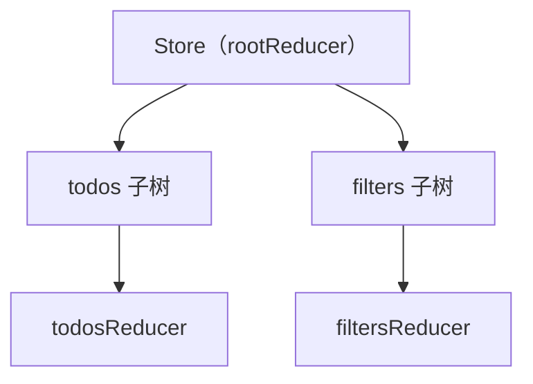
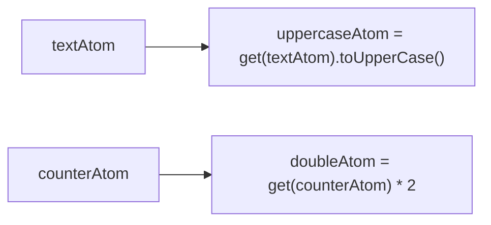
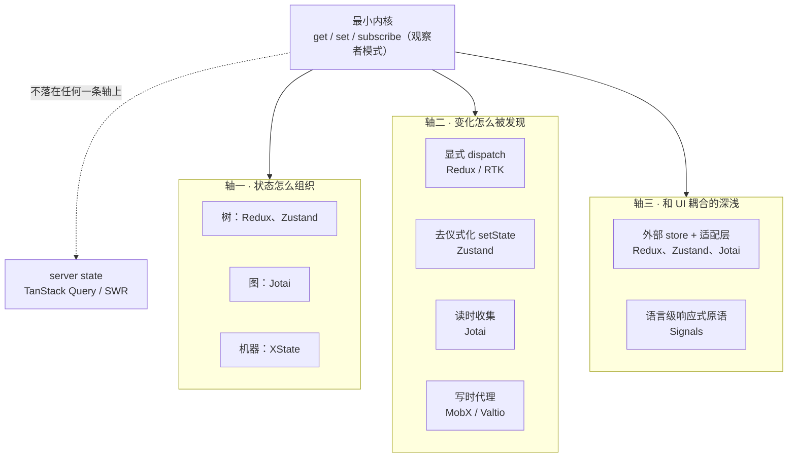
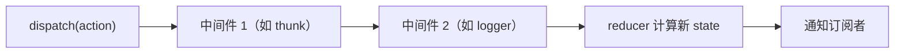

几年前我写过三篇源码精读，分别拆了 Redux、React Redux 加 Redux Toolkit，以及 Jotai。三篇分开看都还算扎实：一篇讲清楚了 dispatch、reducer、subscribe 组成的洋葱模型，一篇讲清楚了 atom 之间怎么用几个 WeakMap 织成一张依赖图。但摆在一起重读，问题也冒出来了。它们讲的是三个互相独立的库，没有回答一个更基本的问题：这些方案到底有没有共同的东西，如果有，分歧又出在哪。


这篇文章想做的，是把这三篇旧文拆开重装，再把 Zustand、MobX/Valtio、Signals、XState 这几个当年没提到的方案放进同一个坐标系里看看。目标不是再写一遍"某个库怎么用"，而是想清楚状态管理这件事，从 jQuery 手动改 DOM 到今天的原子化 store，到底变了什么，又有什么一直没变。


## 从手工维护说起


在 Redux、Vuex 这些名字出现之前，前端应用的状态管理其实很朴素：一个变量存着当前值，用户点了按钮，改这个变量，再手动找到对应的 DOM 节点改一下内容。


```js
let count = 0;

function render() {
  document.getElementById('count').innerText = count;
}

document.getElementById('inc').addEventListener('click', () => {
  count += 1;
  render(); // 别忘了手动调用，不然 UI 就和数据脱节了
});
```


这段代码没有用任何框架，但已经包含了状态管理最原始的三个动作：改数据、算出新值、通知该更新的地方。用一个粗糙但好记的公式表达：


```
NextState = PrevState + Action + Effect
```


新状态等于旧状态，加上一次用户操作（或系统事件），再加上一些副作用（缓存、日志、埋点之类）。这个公式足够朴素，几乎不需要解释，但它恰好也是本文后面所有方案的公共起点：不管是 Redux 的 reducer，还是 Jotai 的 atom write，做的都是同一件事，只是"怎么算新状态""怎么通知该更新的地方"这两个问题，各自给出了不同答案。


手工维护的问题不在于不优雅，是随着应用变复杂，这两件事会一起失控。改数据的地方越来越多，谁改了什么、什么时候改的，慢慢没人说得清；通知谁更新这件事，也从"改完调一下 render"变成"改完这个，那三个地方好像也要跟着变，但会不会漏掉"。


工程上对这两个问题的回应，翻译过来大概是三句话：单一职责，把状态拆开管，别塞进一个变量里；自动化，别靠人记得调用 render，让改动自己触发通知；分层，核心的更新逻辑和外围的插件、副作用分开，方便往里加东西而不用大改。这三句话听起来平淡，但接下来要讲的所有状态管理方案，基本都是在这三句话上做出不同选择的产物。


> 这里的"单一职责"，和 SOLID 原则里那条单一职责原则（Single Responsibility Principle，SRP）说的其实是同一件事，只是应用的对象不同。SRP 是 Robert C. Martin 用来约束类设计的：一个类只该有一个引起它变化的理由。搬到状态管理上，"引起变化的理由"从"某个方法要改"变成了"某一块业务状态要更新"：一个 reducer、一个 atom、一个 slice，理想情况下也只该对应一类会独立变化的状态。Redux 用 combineReducers 把状态拆成一棵树，Jotai 干脆把状态拆成互不打扰的原子，本质上都是在状态这个维度上，重新做一遍 SRP 早就在类设计里做过的事。


> 上一句里的"分层"，对应的则是 SOLID 里的开闭原则（Open-Closed Principle，OCP）：对扩展开放，对修改关闭。核心的更新逻辑应该保持稳定，不该因为要新增一个日志插件、一个异步处理方案，就被迫改动核心代码；新增的能力通过一层可插拔的接口挂进去就行。后面会讲到 Redux 的 applyMiddleware，就是这条原则在状态管理里的一个具体实现：中间件可以叠加，dispatch 的核心流程不用跟着改。


## 一个绕不开的最小内核


如果让一个有经验的前端工程师抛开所有框架，自己写一个"能自动通知更新"的状态容器，大概率会写出这样的东西：


```js
function createStore(reducer) {
  let state;
  let listeners = [];

  function getState() {
    return state;
  }

  function subscribe(listener) {
    listeners.push(listener);
    return () => {
      listeners = listeners.filter((l) => l !== listener);
    };
  }

  function dispatch(action) {
    state = reducer(state, action);
    listeners.forEach((listener) => listener());
  }

  dispatch({}); // 触发一次初始化
  return { dispatch, subscribe, getState };
}
```


这其实就是 Redux 源码里 `createStore` 的核心逻辑，砍掉了中间件、类型校验之后剩下的部分。代码不到 20 行，却已经回答了状态管理最基本的三个问题：怎么读（`getState`）、怎么写（`dispatch` 内部调用 `reducer` 算出新值）、怎么通知（`subscribe` 注册回调，写操作发生后依次调用）。


这三个动作合起来，就是**观察者模式**：一个可观察的对象，一批订阅者，写操作发生时挨个通知。这不是 Redux 的专利，本文后面要讲的 Zustand、Jotai、MobX、Valtio，剥开各自的语法糖，内部都藏着一个结构几乎一样的东西：一个当前值、一份订阅者列表、一个改值后通知订阅者的动作。


那既然内核相同，为什么社区还需要十几个不同的状态管理库？答案不在"要不要有这三个动作"上，是在"这三个动作具体怎么实现"上，这才是真正的分歧所在。往下我会沿着三条轴来看这些分歧：状态怎么组织，变化怎么被发现，和 UI 框架的耦合有多深。


在往下之前，还有一个共性值得单独说一句：这些外部 store 怎么接进 React 的渲染循环？答案基本收敛到了同一个 API，React 18 提供的官方 hook `useSyncExternalStore`，专门用来订阅"React 管不到的外部数据源"：


```js
const snapshot = useSyncExternalStore(subscribe, getSnapshot, getServerSnapshot?)
```


`subscribe` 对应上面的 `store.subscribe`，`getSnapshot` 对应 `store.getState`。React 拿到这两个函数后，就知道什么时候该重渲染、该读哪个值。react-redux 的 `useSelector`、Zustand 的 React 绑定，本质上都是在这个 hook 上包了一层选择器和缓存逻辑。这也是为什么后面读 Redux、Zustand 的源码时，会反复看到同一个函数名，它不是三个库分别发明的，是 React 官方给"外部 store 接入渲染"定的统一接口。


## 分歧轴一：状态怎么组织


这条轴要回答的问题是：应用的所有状态，应该长成什么形状？


### 树：自顶而下的单一状态


Redux 的答案是一棵树，只有一个 store，状态从根节点往下发。为了不让这棵树被一个巨大的 root reducer 塞满，Redux 提供了 `combineReducers`，按 key 把子 reducer 拼装成一棵树：


```ts
const rootReducer = combineReducers({
  todos: todosReducer,
  filters: filtersReducer,
})
```





优点很直白：任何时刻，整个应用的状态就是这一个对象，调试、序列化、时间旅行都只需要面对一个东西。代价也直白，一次 action 派发下去，默认是通知所有订阅者，再各自判断要不要重渲染，这也是为什么 react-redux 的 `useSelector` 要做额外的比较，本质是在给这棵树打一层按需订阅的补丁。


这里可以顺带把 Zustand 放进来对号：它的状态组织方式也是树，一个 store 对应一份可以随意嵌套的 plain object，本质上还是单一状态树，只是不强制通过 `combineReducers` 拼装，可以直接手写嵌套对象。也就是说，在"状态怎么组织"这条轴上，Zustand 和 Redux 站在同一个点，并没有分歧；它们真正的分歧要到下一条轴，也就是"变化怎么被发现"，才会显出来。


### 图：原子化的依赖网


Jotai 的答案完全不同：没有一棵大树，只有一堆原子，原子之间通过读取时是否互相引用，结成一张依赖图。


```ts
const textAtom = atom('readonly atoms')
const uppercaseAtom = atom((get) => get(textAtom).toUpperCase())
```





Jotai 内部用三个 Map 维护这张图：`atomStateMap` 记录每个原子当前的值和它这一轮依赖了谁，`mountedMap` 记录谁在监听这个原子、谁依赖了这个原子，`pendingMap` 记录哪些原子值已经变了但还没通知出去。整张图是自底而上生长的，没人订阅的原子甚至不会被计算，用到才算，这也是它被称为"原子化"的原因。


### 机器：被显式约束的状态转移


前两种方案回答的都是"状态存在哪、长什么样"，XState 换了一个问题：状态可以怎么变。它把应用建模成有限状态机（更准确说是 statechart）：状态是一个个命名好的节点，事件触发转移，转移只能发生在明确声明过的边上。


```js
import { createMachine, createActor } from 'xstate'

const toggleMachine = createMachine({
  id: 'toggle',
  initial: 'inactive',
  states: {
    inactive: { on: { toggle: 'active' } },
    active: { on: { toggle: 'inactive' } },
  },
})
```


这段定义里，没有声明的转移根本不存在。如果 `active` 状态下发生了一个 `toggle` 之外的事件，机器什么都不会做。这一点和 Redux、Jotai 都不同：一个 reducer 理论上可以对任意 action 返回任意新状态，"加载中"和"已经有数据"同时成立这种不该存在的状态，Redux 从设计上并不禁止，得靠代码或类型去堵。XState 是把这道门直接砌死在了状态空间的定义里。


这也是为什么把 XState 单独归为一条轴上的第三个点，而不是"另一个 Redux 竞品"：它和树、图关心的不是同一个问题。"状态该长成什么样"和"状态能怎么变"是两个可以叠加使用的问题，完全可以在 Zustand 的 store 里存一段 XState 机器的 context，两者不冲突。


小结一下这条轴：


| 组织方式 | 代表 | 状态形状 | 典型代价 |
|---|---|---|---|
| 树 | Redux、Zustand | 单一 object tree | 大树难拆，需要 selector 打补丁 |
| 图 | Jotai | 原子依赖网 | 依赖关系隐式，调试要顺着图找 |
| 机器 | XState | 显式状态节点 + 转移表 | 建模成本高，简单场景显得笨重 |


## 分歧轴二：变化怎么被发现


这条轴回答的是：状态变了之后，"谁需要知道"是怎么被算出来的。这也是本文最想讲清楚的一条轴，因为它才是各家框架"用起来感觉不一样"的真正原因。


### 显式 dispatch：把发生了什么写清楚


Redux 的选择最保守：任何一次改变，都必须先描述成一个 action 对象，交给 reducer 去算。谁改的、改了什么，天然留下一条可读的记录，这也是 Redux DevTools 时间旅行调试能做起来的根本原因。代价是仪式感：哪怕只是想把一个数字加一，也要先定义 action type，再写 reducer 分支。


Redux Toolkit 的 `createSlice` 没有改变这套机制，只是自动生成了这些样板代码。它内部用了 immer，允许在 reducer 里"看起来"直接改 state：


```ts
reducers: {
  increment: (state) => {
    state.value += 1 // 看起来是 mutate，实际 immer 在背后生成了新对象
  },
}
```


这句代码之所以不违反 Redux 的不可变原则，是因为 immer 在背后拦截了这次赋值，生成了一份新对象，写法变了，机制没变。


### 读时收集：算的时候才知道依赖谁


Jotai 的做法是反过来的：不要求提前声明依赖，而是在原子第一次被读取、执行 `atom.read(get)` 的过程中，通过 `get()` 实际调用了哪些原子，动态记录下这次的依赖关系：


```ts
const getter = (a) => {
  const aState = readAtomState(a)
  nextDependencies.set(a, aState) // 读到了谁，就记下依赖谁
  return returnAtomValue(aState)
}
const v = atom.read(getter)
```


这是一种**拉模型**：依赖关系不是写死的，是每次重新计算时，顺手在执行过程里采集出来的。好处是天然精确，依赖了什么，代码本身就说明了，不需要额外声明；代价是这份依赖关系是运行时动态算出来的，出问题时不太好凭直觉推断，需要顺着 `atomStateMap` 一层层看。


### 写时代理：改的时候就通知


MobX 和 Valtio 选了第三条路：不需要显式 dispatch，也不需要手动调用 get，而是用 JavaScript 的 Proxy，直接在读和写这两个语言层面的动作上做拦截。


一个最小的示意实现（参考 Vue 官方文档给出的原理性伪代码）大概是这样：


```js
function reactive(obj) {
  return new Proxy(obj, {
    get(target, key) {
      track(target, key) // 读：把当前正在执行的 effect 记为这个 key 的订阅者
      return target[key]
    },
    set(target, key, value) {
      target[key] = value
      trigger(target, key) // 写：通知所有订阅了这个 key 的 effect
      return true
    },
  })
}
```


这是一种**推模型**：写操作发生的那一刻，立刻通知此前收集到的订阅者，不需要等谁来主动拉取。MobX 的 `autorun`、Valtio 的 `useSnapshot`，都是在这套 get/set 拦截的基础上，各自加了一层订阅管理。Valtio 甚至把读、写两件事拆成了两层 Proxy：一层专门在 `proxy()` 上拦截写操作，给状态打版本号；另一层在 `useSnapshot()` 上拦截读操作，决定组件该不该重渲染。这样设计的原因是 React 的并发渲染要求读和写的时序不能简单绑死在一起。


写时代理这条路径最大的好处是写法上几乎没有仪式感，`state.count++` 就是全部代码；代价是"到底谁依赖了这个字段"变成了一件隐式的事，出了 bug 得靠工具（比如 MobX 的开发者工具）才看得清订阅关系。


### 去仪式化的显式更新：Zustand 的取巧之处


读到这里，可以回头看看 Zustand 是怎么选的。它其实哪条新路都没走，选的是"Redux 的内核，去掉 Redux 的仪式"。翻开 Zustand 的核心实现（下面是照着它的思路简化重建的逻辑，不是逐字复制源码），会发现它和本文第二节那个 20 行的极简 `createStore` 几乎是同一个结构：一个 state 变量、一个订阅者集合、一个 setState 触发通知：


```js
function createStoreImpl(createState) {
  let state
  const listeners = new Set()

  const setState = (partial, replace) => {
    const nextState = typeof partial === 'function' ? partial(state) : partial
    if (!Object.is(nextState, state)) {
      state = replace ? nextState : Object.assign({}, state, nextState)
      listeners.forEach((listener) => listener(state))
    }
  }

  const getState = () => state
  const subscribe = (listener) => {
    listeners.add(listener)
    return () => listeners.delete(listener)
  }

  state = createState(setState, getState)
  return { setState, getState, subscribe }
}
```


对比着看会发现，Zustand 真正的改动只有一处：把 Redux 里"`dispatch(action)` 再交给 `reducer(state, action)` 算"这一步拿掉了，换成直接调用 `setState`。没有 action type，没有必须写成纯函数的 reducer，更新逻辑可以就是 store 上的一个方法。这不是一种新的发现变化机制，是同一套观察者内核，卸掉了 Redux 那层必须先描述成 action 的仪式。它接入 React 时用的也是前面提到的 `useSyncExternalStore`，和 Redux 走的是同一条标准通路，只是省掉了中间那层额外的包装。


这也印证了本文一直想说的一件事：Zustand 看起来和 Redux 差别很大，但从"变化怎么被发现"这条轴上看，它们其实站在同一个点上，都是显式调用一个函数触发更新，区别只是这个函数要不要长成 action 加 reducer 的形状。


把这条轴上四种方案放在一起看：


| 发现机制 | 代表 | 触发方式 | 心智负担 | 可调试性 |
|---|---|---|---|---|
| 显式 dispatch | Redux / RTK | action 交给 reducer | 高，要先描述成 action | 强，可回放、可时间旅行 |
| 去仪式化显式更新 | Zustand | 直接调用 setState | 低 | 中，没有 action 记录 |
| 读时收集 | Jotai | 读取时动态采集依赖 | 中，依赖隐式但可推导 | 中，要顺依赖图看 |
| 写时代理 | MobX / Valtio | Proxy 拦截 get/set | 低，写法像原生对象 | 弱，依赖关系靠工具可视化 |


## 分歧轴三：和 UI 框架耦合的深浅


这条轴的问题是：状态变了之后，怎么让 UI 也变这件事，是框架自己管，还是外部库自己接进去？


到这里为止讲的 Redux、Zustand、Jotai，内部机制天差地别，但在"怎么让 React 知道该重渲染"这一层，答案是一样的：它们都是 React 眼里的**外部 store**，都通过 `useSyncExternalStore` 这层胶水接进 React 的渲染循环。React 并不知道 Redux 的 reducer、Jotai 的 atom 图具体怎么运作，它只关心给我一个订阅函数、给我一个取值函数，自己决定什么时候重渲染。


Signals（Preact Signals、SolidJS 的 signal、Vue 的 ref）选的是另一条路：不做外部 store，而是把响应式做成语言层面的原语，深深嵌进渲染系统内部。SolidJS 官方文档里的说法很直接：一个 signal 在追踪范围内被读取时，会把自己注册为订阅者，写入时通知所有订阅者，这个过程发生在编译产物内部，不经过虚拟 DOM 的整棵重渲染，而是直接精确更新到具体的 DOM 节点。


> 这里补充一句它具体是怎么做到的：Solid 根本没有虚拟 DOM 这一层。编译阶段（一个 babel 插件）会把 JSX 里静态的部分，直接编译成一次性创建好的真实 DOM 节点；只有引用了 signal 的动态表达式，才会被单独包一层细粒度的 effect，直接绑定到那个具体的节点或属性上，比如 `node.textContent = () => count()`。组件函数本身只在挂载时执行一次，用来搭好这些节点和绑定；之后 signal 变化，不会重新执行整个组件函数，只会触发它绑定的那个小 effect，直接改一次 DOM。少的正是"重新渲染整棵组件树、再去比较差异"这一步，这也是为什么 Solid 官方文档会强调自己是"编译到真实 DOM 节点，再叠加细粒度的响应式绑定"，而不是"更快的虚拟 DOM"。


```js
import { createSignal, createMemo } from 'solid-js'

const [count, setCount] = createSignal(0)
const double = createMemo(() => count() * 2)
```


这句代码看起来和 Jotai 的 atom 很像，读的时候自动收集依赖，写的时候自动通知，但关键差别在于通知之后发生了什么。Jotai 的通知最终还是要走 React 的 `useSyncExternalStore`，触发一次组件重渲染；Solid 这类原生 signal 框架的通知，可以直接落到某个具体的 DOM 文本节点上，不需要重新执行整个组件函数。


React 生态里也有对应的尝试，比较有代表性的是 `@preact/signals-react`：如果把一个 signal 直接放进 JSX，而不是取它的 `.value`，可以做到跳过组件重渲染，直接更新对应的文本节点：


```jsx
const count = signal(0)

// 常规写法：count.value 变化会触发整个组件重渲染
function Counter() { return <p>Value: {count.value}</p> }

// 优化写法：count 本身放进 JSX，只更新这个文本节点
function Counter() { return <p>Value: {count}</p> }
```


这里需要说清楚一个边界。React 团队自己在 2025 年 10 月发布的 React Compiler 1.0，做的是编译期自动记忆化：帮你自动补上原本要手写的 `useMemo`、`useCallback`，减少不必要的重渲染，但它优化的仍然是 React 现有的组件和虚拟 DOM 模型，并不是把 signal 这种细粒度原语带进 React 内核。同一时间，TC39 有一个 Signals 提案，目前处于 Stage 1，出自 Angular、Vue、Solid、Preact、MobX、Svelte 等多个框架维护者的联合提案，想给整个 JS 生态定义一套框架无关的信号原语，但截至目前还没有定稿，也没有内置的 effect API，各家框架仍然要自己实现响应式的落地部分。这方面确实存在不确定性，只能算是值得持续关注的方向，不代表已经发生的事实。


小结这条轴：Redux、Zustand、Jotai 是在 UI 框架之外接一个店，靠标准接口对接；Signals 是把响应式做成语言原语，直接嵌进渲染系统内部。前者的好处是和框架解耦、可以跨框架复用；后者的好处是更新粒度可以做到 DOM 节点级别，代价是和某个框架或编译器绑得更深。


## 把三条轴拼成一张图


前面是分轴讲的，每条轴单独配了一张图、一张表，读到这里容易忘了它们本来同属一个坐标系。这里把内核和三条轴拼在一张架构图里，顺便标出 server state 为什么被单独挑出去、不落在任何一条轴上：





从这张图能看出两件事：一是 Redux、Zustand、Jotai 这几个名字会在不止一条轴上重复出现，它们在轴一可能站在同一个点（比如 Redux 和 Zustand 都是"树"），但在轴二上分道扬镳，一个方案真正的设计取舍，要看它在三条轴上的位置组合，不能只看某一条轴。二是 TanStack Query 用虚线连出去，因为它从一开始问的就不是"状态该组织成什么形状""变化怎么被发现"这类问题，不属于这个坐标系，这也是为什么前面单独用一节把它摘出来讲。


## 回到源码：三条轴怎么解释 Redux 全家桶


有了三条轴，可以回头再读一遍 Redux 相关的源码，会发现之前零散的 API 一下子有了共同的解释框架。


`combineReducers` 只是做了一次浅拷贝加过滤：


```ts
export default function combineReducers(reducers) {
  const finalReducerKeys = Object.keys(reducers)
  return function combination(state = {}, action) {
    let hasChanged = false
    const nextState = {}
    for (const key of finalReducerKeys) {
      const previousStateForKey = state[key]
      const nextStateForKey = reducers[key](previousStateForKey, action)
      nextState[key] = nextStateForKey
      hasChanged = hasChanged || nextStateForKey !== previousStateForKey
    }
    return hasChanged ? nextState : state
  }
}
```


它做的事情正好对应"分歧轴一"里"树"这个选择的具体落地方式：一个 action 会被分发给树上每一个子 reducer，各自判断要不要变，只要有一个变了，就返回一份新的顶层对象引用。`hasChanged` 这个标志位很关键，它保证了没变的部分保持引用不变，这也是后面 react-redux 用浅比较能生效的前提。


Redux 的三大原则里有一条是用纯函数描述修改，但真实业务里几乎不可能没有异步请求。redux-thunk 中间件解决的正是这个矛盾：


```ts
const middleware = ({ dispatch, getState }) => (next) => (action) => {
  if (typeof action === 'function') {
    return action(dispatch, getState) // action 是函数，说明它是异步逻辑，直接执行
  }
  return next(action) // 是普通对象，交给下一个中间件，最终到 reducer
}
```


`applyMiddleware` 把多个这样的中间件，通过 `compose` 函数嵌套包裹成一条链：dispatch 一次，就相当于从外到内穿过所有中间件，最内层才是真正的 reducer 计算。





thunk 中间件做的事情，本质是在这条链的最外面截住函数类型的 action，直接执行它，不让它进入需要保持纯粹的 reducer 内部。这不是一种新的发现变化机制，只是给"显式 dispatch"这条路径加了一层可插拔的预处理，同一套机制后面在 Redux Toolkit 的 `configureStore` 里也被复用，去默认注入开发环境检查和批处理优化。


Redux Toolkit 想解决的问题，从来不是机制层面的问题，是写起来太啰嗦这个纯工程问题：action type 常量、action creator、reducer、selector 四份东西分散在不同地方，一个 feature 改动要跟着改四处。`createSlice` 做的事情，是把这四份东西收进一个配置对象里，自动生成剩下的：


```ts
export const counterSlice = createSlice({
  name: 'counter',
  initialState: { value: 0 },
  reducers: {
    increment: (state) => { state.value += 1 },
  },
})
```


这里能直接对 state 做类似 mutate 的写法，是因为 `createSlice` 内部集成了 immer，在背后用 Proxy 拦截了这次看起来是 mutate 的赋值，实际生成的仍然是一份新对象。这个细节也提醒了一件事：即便是最"显式 dispatch"的阵营，落到实现细节，也悄悄借用了写时代理这条路径的部分技巧，只是用途不同。Redux 生态用 Proxy 是为了让写法更顺手，同时保证底层的不可变性；MobX、Valtio 用 Proxy 是把它直接作为发现变化的核心机制。两者用的是同一把工具，解决的是不同层面的问题。


到了 react-redux 这一层，就是"分歧轴三"里外部 store 通过标准接口接入 React 的具体样本：`Provider` 通过 Context 把 store 传下去，`useSelector` 内部调用的正是 `useSyncExternalStoreWithSelector`，也就是 `useSyncExternalStore` 的增强版本，多了一层选择器取子集和缓存的能力：


```ts
const selectedState = useSyncExternalStoreWithSelector(
  subscription.addNestedSub,
  store.getState,
  getServerState || store.getState,
  wrappedSelector,
  equalityFn,
)
```


react-redux 还在开发环境下加了两个额外检查：一个检测 selector 两次调用结果是否一致，避免因为返回了新引用而多余重渲染；另一个检测有没有直接把整个 state 返回出去，比如 `useSelector(state => state)`，这必然导致每次 dispatch 都重渲染。这两个检查本质上都在替开发者堵一个和发现变化机制直接相关的坑：选择器如果没有保证引用稳定，浅比较这层优化就完全失效了。


## 回到源码：Jotai 的依赖图怎么落地


再看 Jotai，前面提炼的"图"和"读时收集"这两条结论，在源码里对应的是三个数据结构的配合。下面几段是照着 Jotai 源码简化重建的骨架，省略了异步、错误处理这些分支，先看类型定义和 `createStore` 的骨架：


```ts
type Dependencies = Map<AnyAtom, AtomState>
type AtomState<Value = AnyValue> = {
  d: Dependencies // 这一轮依赖了谁
} & ({ e: AnyError } | { v: Value })
type Mounted = {
  l: Listeners // 谁在监听这个 atom
  t: Dependents // 谁依赖了这个 atom（用于反向通知）
}

function createStore() {
  const atomStateMap = new WeakMap<AnyAtom, AtomState>()
  const mountedMap = new WeakMap<AnyAtom, Mounted>()
  const pendingMap = new Map<AnyAtom, AtomState | undefined>()
  // ...
}
```


`atomStateMap` 记录每个 atom 当前的值和它这一轮依赖了谁；`mountedMap` 记录每个 atom 被谁监听、谁依赖了它；`pendingMap` 记录值已经变了但还没通知出去的 atom，等下一轮统一消费。


读一个 atom 时，核心逻辑封装在一个 `getter` 里：如果这个 atom 已经挂载，或者它依赖的所有 atom 都没变化，直接返回缓存值；否则重新执行 `atom.read(getter)`，期间每一次 `get(otherAtom)` 都会顺手把 `otherAtom` 记进这次的依赖集合：


```ts
const getter: Getter = (a) => {
  const aState = readAtomState(a) // 递归读取 a 的最新值
  nextDependencies.set(a, aState) // 读到了谁，就记下依赖谁
  return returnAtomValue(aState)
}
const v = atom.read(getter) // 执行 atom 自己的 read 函数，期间会多次调用 getter
```


写一个 atom 时，走的是相反方向：真正落到某个原子上完成写入后，会调用 `recomputeDependents`，顺着 `mountedMap` 里记录的反向链路，把所有下游都推入 `pendingMap`；如果这次写的不是目标原子本身，而是它依赖的另一个原子，就递归继续往下写：


```ts
const setter: Setter = (a, ...args) => {
  if (a === atom) {
    const prevAtomState = getAtomState(a)
    const nextAtomState = setAtomValue(a, args[0])
    if (!prevAtomState || !isEqualAtomValue(prevAtomState, nextAtomState)) {
      recomputeDependents(a) // 顺着 mountedMap 找到所有依赖 a 的下游，推入 pendingMap
    }
  } else {
    writeAtomState(a, ...args) // 不是目标 atom，说明是它依赖的另一个 atom，递归继续写
  }
}
```


最后由 `flushPending` 统一消费 `pendingMap`，触发真正订阅了这些 atom 的 React 组件重渲染：


```ts
const flushPending = () => {
  while (pendingMap.size) {
    const pending = Array.from(pendingMap)
    pendingMap.clear()
    pending.forEach(([atom]) => {
      const mounted = mountedMap.get(atom)
      mounted?.l.forEach((listener) => listener()) // 通知所有监听这个 atom 的组件
    })
  }
}
```


这套机制最精巧的地方，是读和写用了两套相反的遍历方向：读的时候顺着"我依赖谁"往下算（对应上面的 `getter`），写的时候顺着"谁依赖我"往上通知（对应上面的 `recomputeDependents`）。这也是为什么 Jotai 能做到真正的按需计算，没有被订阅的原子链路，既不会被读，也不会被写通知触达，白白算一遍的成本被压到了最低。


## 一个容易混进来的相邻问题：server state 不是 client state


讲完这几条轴，还有一件事必须单独拎出来说清楚，否则很容易被误会成这篇文章漏了 TanStack Query、SWR 这两个大家伙。事实是，它们压根不在同一个坐标系里。


TanStack Query 官方文档对这件事的表述非常直接：


> While most traditional state management libraries are great for working with client state, they are not so great at working with async or server state. This is because server state is totally different.


翻译过来：Redux、Zustand、Jotai、MobX 管理的是**客户端状态**，这份数据活在应用内存里，说改就能改，改完立刻生效。而服务端状态天然不同：它存在别处，你未必拥有它，读写都要走异步接口，还可能被别人在你不知道的时候改掉，随时可能过期。


TanStack Query 解决的问题清单，和上面讲的三条轴完全不是一回事：数据多久算新鲜（`staleTime`），什么时候该在后台悄悄重新拉一次，同一份数据被好几个组件同时请求要不要去重，缓存要不要在数据不再被使用之后自动回收。这些问题在 Redux 或 Jotai 的世界里根本不存在，因为它们管理的数据从来不会自己过期。


所以一个项目里，同时用 Zustand 管理主题、侧边栏这类纯客户端状态，同时用 TanStack Query 管理列表数据这类服务端状态，完全不冲突，它们本来就在解决两个不同维度的问题。TanStack Query 的文档里也提到，接入之后，项目里真正需要全局客户端状态管理的部分，往往会缩小到只剩 UI 相关的那一小撮状态，这也从另一个角度说明了两者的分工边界。


## 怎么选：一张决策表


到这里，七种方案已经在三条轴上各自找到了自己的位置。落到实际选型，可以按几个常见的工程问题对号：


| 你的场景 | 更适合 | 理由 |
|---|---|---|
| 需要时间旅行调试、团队规模大、需要强约束的变更记录 | Redux / RTK | 显式 dispatch 天然留痕，DevTools 生态最成熟 |
| 中小型应用，想要 store 但不想要仪式感 | Zustand | 同样的内核，去掉 action、reducer 的模板代码 |
| 状态之间有大量派生计算，希望按需计算、精确到字段级更新 | Jotai | 原子依赖图天然支持细粒度订阅 |
| 团队更习惯直接改对象的写法，或从 Vue、Angular 迁移过来 | MobX / Valtio | 写时代理让心智模型更接近面向对象 |
| 有明确的合法或非法转移关系，比如审批流、多步表单、播放器状态 | XState | 用状态机把不可能状态提前挡在类型层面 |
| 极致关心渲染性能，愿意接受更深的框架或编译器耦合 | Signals | 更新粒度可以做到 DOM 节点级别 |
| 数据来自后端接口，核心问题是缓存、去重、失效 | TanStack Query / SWR | 这从来不是选哪个状态管理库的问题 |


这张表不是用来选一个赢家的，很多真实项目里，这些方案是叠着用的：Zustand 存 UI 状态，TanStack Query 管接口数据，某个复杂表单单独用 XState 建模，它们本来就活在不同的轴上，谈不上互相替代。


## 小结


回到最开始那个公式：


```
NextState = PrevState + Action + Effect
```


这篇文章想说明的是，几乎所有状态管理方案，都是在回答这个公式背后藏着的三个具体问题：状态应该长成什么形状，是树、图，还是机器；"发生了变化"这件事该怎么被发现，是显式声明、读时收集，还是写时拦截；这套机制和 UI 框架的渲染循环，应该隔着一层标准接口，还是干脆长在一起。


Redux 选了树、显式 dispatch、外部接入；Jotai 选了图、读时收集、外部接入；Zustand 证明了外部接入这条路径上，仪式感是可以单独拆掉的；MobX、Valtio 换了一整套写时代理的发现机制；XState 换了个维度，去约束状态转移本身；Signals 则在第三条轴上走到了另一个极端，把响应式嵌进了渲染系统内部。至于 TanStack Query，它一开始问的就不是这几条轴上的任何一个问题。


如果只记住一句话：状态管理这十几年的演进，不是一场哪个库更先进的擂台赛，是同一个最小内核，在三条设计分歧上，被反复重新组合出来的不同答案。理解了这三条轴，下次遇到一个新出现的状态管理方案，大概能少花很多时间，先问它这三个问题，再决定要不要细读源码。


## 参考资料


- [Redux 官方文档](https://redux.js.org/) —— Redux 三大原则、createStore、combineReducers、applyMiddleware 的官方解释
- [Redux Toolkit 官方文档](https://redux.js.org/introduction/why-rtk-is-redux-today) —— createSlice、configureStore 的设计动机
- [React Redux 官方文档](https://react-redux.js.org/) —— Provider、useSelector、useDispatch 的实现说明
- [React 官方文档：useSyncExternalStore](https://react.dev/reference/react/useSyncExternalStore) —— 外部 store 接入 React 渲染循环的标准接口
- [Jotai 官方仓库](https://github.com/pmndrs/jotai) —— atom、store 的核心实现
- [Zustand 官方仓库](https://github.com/pmndrs/zustand) —— createStore、React 绑定的源码
- [Valtio 官方文档：How Valtio Works](https://valtio.dev/docs/how-tos/how-valtio-works) —— 读写分离的双层 Proxy 设计
- [MobX 官方文档：Reactions](https://mobx.js.org/reactions.html) —— autorun 的依赖收集机制
- [SolidJS 官方文档：Signals](https://docs.solidjs.com/concepts/signals) —— signal 的追踪与通知机制
- [Preact Signals 仓库](https://github.com/preactjs/signals) —— signals-react 的 JSX 优化写法
- [TC39 Signals 提案](https://github.com/tc39/proposal-signals) —— 框架无关信号原语的 Stage 1 提案
- [React Compiler 1.0 发布博客](https://react.dev/blog/2025/10/07/react-compiler-1) —— 编译期自动记忆化，不引入原生 signal
- [Stately / XState 官方文档](https://stately.ai/docs) —— 状态机、actor 模型的完整说明
- [TanStack Query 官方文档：Overview](https://tanstack.com/query/latest/docs/framework/react/overview) —— server state 与 client state 的边界定义
- [SWR 官方文档](https://swr.vercel.app/) —— stale-while-revalidate 缓存策略的说明
